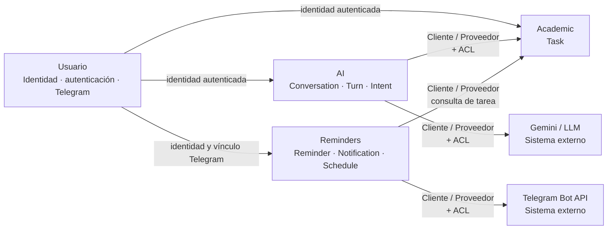

# 1. Introducción y objetivos

TAIA (Task Artificial Intelligence Assistant) es un asistente académico para
estudiantes universitarios. Ofrece dos canales de entrada —un bot de Telegram y
una aplicación móvil Flutter— sobre un backend compartido.

El problema tiene dos caras. La primera es la **fricción de captura**: el
estudiante se entera de una tarea justo cuando no puede detenerse a llenar un
formulario —en clase, saliendo del salón, leyendo un chat de grupo—, y el
formulario exige tiempo, atención y manos libres. Cuando faltan, la tarea no se
registra y se olvida. TAIA permite registrarla escribiendo una frase suelta en
Telegram, un canal que el estudiante ya tiene abierto. La segunda es la
**organización y el hábito**: registrar no basta, porque el estudiante también
necesita distribuir su tiempo de estudio y sostener la constancia. TAIA usa un
modelo de lenguaje (LLM) para proponer horarios compatibles con el horario de
clases, entre los cuales el estudiante elige.

Frente a Google Calendar, Notion o un bot de recordatorios genérico, el
diferenciador es la combinación de captura conversacional sin formulario,
interpretación automática del lenguaje natural y planificación proactiva del
tiempo de estudio: las herramientas existentes o exigen estructura manual o no
planifican. La identidad visual del sistema es un pulpo: muchos brazos, muchas
tareas atendidas a la vez.

## 1.1. Resumen de requisitos

El sistema recibe mensajes en lenguaje natural, los interpreta mediante un LLM,
extrae los campos de una tarea académica, pide confirmación al usuario y los
persiste. A partir de ahí notifica las tareas próximas a vencer y propone planes
de estudio; la misma información es consultable desde la aplicación móvil.

El público inicial son los estudiantes de nuestra universidad, con la intención
de extender el sistema a otras. El volumen esperado en la primera etapa es de
**decenas de usuarios activos**, con picos en la mañana y en la noche.

| ID | Requisito | Horizonte |
|---|---|---|
| RF-01 | El sistema debe permitir registrar información académica mediante lenguaje natural | MVP |
| RF-02 | El sistema debe permitir consultar la información académica propia del estudiante | MVP |
| RF-03 | El sistema debe interpretar solicitudes del estudiante mediante un servicio de inteligencia artificial | MVP |
| RF-04 | El sistema debe validar la información interpretada antes de almacenarla | MVP |
| RF-05 | El sistema debe generar y entregar recordatorios asociados a la información académica registrada | MVP |
| RF-06 | El sistema debe mantener aislada la información académica de cada estudiante | MVP |
| RF-07 | El sistema debe permitir la interacción mediante Telegram y la aplicación cliente | MVP |
| RF-08 | Sistema de recompensas por constancia (árbol que crece con las sesiones completadas) | Deseable, posterior al MVP |

RF-08 es **deseable, no comprometido**: se abordará después del MVP y su
ausencia no invalida el producto.

El primer corte vertical es el aspecto A-01, que implementa actualmente el
recorrido de registro de tareas mediante la API HTTP → caso de uso →
dominio → repositorio en memoria. La integración con Telegram, la
interpretación mediante el LLM, la persistencia en PostgreSQL y la
visualización en la aplicación forman parte de la arquitectura objetivo y
serán incorporadas en iteraciones posteriores.

## 1.2. Objetivos de calidad

Los objetivos de calidad de TAIA se priorizan de acuerdo con su impacto sobre la utilidad del sistema y el riesgo técnico asociado.

| Priority | Quality Goal | Description | Related Scenario |
|---|---|---|---|
| 1 | **Seguridad y privacidad** | Garantizar que cada estudiante pueda acceder únicamente a su propia información académica y que los intentos de acceso no autorizado sean rechazados. | S4 — Acceso únicamente a datos del propio estudiante |
| 2 | **Exactitud** | Garantizar que la información académica expresada en lenguaje natural sea interpretada y registrada correctamente. | S1 — Registro correcto de información académica |
| 3 | **Puntualidad** | Garantizar que los recordatorios académicos sean entregados cerca de la hora programada. | S2 — Entrega puntual de recordatorios |
| 4 | **Rendimiento** | Mantener tiempos de respuesta adecuados para las interacciones con el asistente. | S3 — Respuesta del asistente ante un mensaje |
| 5 | **Mantenibilidad** | Permitir la sustitución del proveedor o modelo de IA sin modificar la lógica de negocio principal ni la persistencia del sistema. | S5 — Sustitución del modelo de IA |

Los objetivos se consideran prioritarios porque TAIA gestiona información académica personal, depende de servicios externos para la interpretación mediante IA y requiere ofrecer una interacción suficientemente rápida y confiable para resultar útil al estudiante.

## 1.3. Interesados

| Rol | Quién | Expectativa |
|---|---|---|
| Estudiante usuario | Estudiantes de la universidad; a futuro, de otras universidades | Registrar tareas sin fricción, recibir recordatorios fiables y obtener un plan de estudio realista |
| Equipo de desarrollo | Luis Mendoza, Deiner Gonzales, Valeria Berrio, Mark Pastrana | Una arquitectura comprensible y documentada que puedan construir entre cuatro personas dentro del plazo del curso |
| Docente evaluador | Profesor del curso de Arquitectura de Software | Documentación arquitectónica trazable (requisito → C4 → ADR → código → pruebas → evidencia) y uso de IA registrado |

# 2. Restricciones de arquitectura

Para cada restricción se indica su implicación arquitectónica: qué obliga o qué
prohíbe al construir el sistema.

**Restricciones técnicas**

| Restricción | Implicación arquitectónica |
|---|---|
| Stack definido: Flutter (cliente móvil), FastAPI (backend), PostgreSQL (persistencia), Telegram Bot API (canal conversacional y de notificación) y Gemini (proveedor LLM actual) | La elección tecnológica no está en discusión; el diseño se concentra en repartir responsabilidades entre esas piezas, no en sustituirlas |
| Plataforma objetivo: **Android** | iOS y web quedan fuera de esta etapa; no se invierte esfuerzo en abstracciones multiplataforma más allá de lo que Flutter ofrece por defecto |
| El proveedor de LLM debe ser **intercambiable** | El sistema depende de una interfaz propia (puerto) y el SDK del proveedor queda aislado tras un adaptador; ningún otro componente puede acoplarse a Gemini directamente |
| **Costo cero**: toda la infraestructura opera dentro de capas gratuitas | Impone tres límites duros: cuotas de peticiones y tokens del LLM, que obligan a controlar el tamaño del contexto enviado; límites de almacenamiento y conexiones de la base de datos; y un hosting que puede suspender el proceso por inactividad, lo cual afecta a las notificaciones programadas (RF-05) y obliga a un disparo que no dependa de un proceso siempre activo |
| Despliegue previsto en Render o en la capa gratuita de AWS | La decisión no está cerrada y se documentará en un ADR; hasta entonces el diseño evita depender de servicios propios de un proveedor concreto |
| El canal de registro depende de un tercero (Telegram) | El equipo no controla su disponibilidad ni sus políticas. Esta acción debe ser realizada por el propietario de la organización. |

**Restricciones organizacionales**

| Restricción | Implicación arquitectónica |
|---|---|
| Equipo de cuatro personas, sin dedicación completa, dentro del calendario académico del curso | Favorece soluciones simples y comprensibles por todo el equipo frente a soluciones óptimas pero costosas de construir |
| El proyecto se desarrolla por **aspectos**: cortes verticales trazados en `docs/aspectos.md` con la cadena Requisito → C4 → ADR → Código → Pruebas → Evidencia | Cada incremento atraviesa todas las capas y deja trazabilidad completa; no se construyen capas horizontales aisladas |
| **Registro obligatorio del uso de IA** en `docs/ia.md`, con el formato de entrada numerada exigido por el curso | Todo uso significativo de IA en el desarrollo queda documentado, revisado y verificado por el equipo |
| Entregables y fechas definidos por el curso | No se documentan fechas concretas por no estar confirmadas; se añadirán cuando el equipo las fije |

**Restricciones legales**

| Restricción | Implicación arquitectónica |
|---|---|
| El sistema debe cumplir con las obligaciones aplicables de protección de datos personales sobre la información académica asociada a cada estudiante | La arquitectura debe limitar el acceso a los datos al usuario correspondiente, evitar la exposición innecesaria de información personal y mantener mecanismos de control que permitan proteger los datos almacenados y transmitidos |

**Convenciones**

| Convención | Implicación arquitectónica |
|---|---|
| Documentación del proyecto en español | Se redacta en español con independencia del idioma de las plantillas empleadas |
| Documentación arquitectónica siguiendo **arc42 v9.0**, escrita dentro de `docs/arc42/arc42.md` | Se conserva la estructura y numeración de la plantilla arc42 v9.0; el contenido se documenta en español. |
| Diagramas siguiendo el **modelo C4** | Las vistas de contexto, contenedores y componentes se expresan en los niveles de C4 y se enlazan desde el aspecto correspondiente |
| Decisiones arquitectónicas registradas como **ADR** | Toda decisión estructural —proveedor de LLM, plataforma de despliegue, mecanismo de notificaciones— se documenta como ADR enlazado desde `docs/aspectos.md` |
| Código, identificadores y mensajes de commit en inglés; comentarios y documentación en español | Convención propuesta, aún no fijada por el equipo |
| `README.md` está codificado en UTF-16 LE; el resto del repositorio en UTF-8 | Las herramientas y scripts que procesen el repositorio deben contemplar esa diferencia |

# 3. Contexto y alcance

## 3.1. Contexto de negocio
TAIA se sitúa entre el estudiante y los servicios necesarios para gestionar su información académica.

El estudiante utiliza TAIA para **registrar y consultar información académica**, así como para **recibir recordatorios**. TAIA interpreta las solicitudes expresadas en lenguaje natural, procesa las operaciones correspondientes y mantiene la información asociada al estudiante.

### Intercambio principal

```text
+------------------+
|    Estudiante    |
+--------+---------+
         |
         | registra / consulta información
         | y recibe recordatorios
         v
+--------------------------+
|           TAIA           |
| Task Artificial          |
| Intelligence Assistant   |
+-----------+--------------+
            |
            | interpretación de lenguaje natural
            v
+--------------------------+
| Servicio de IA (Gemini)  |
+--------------------------+

TAIA <----> Telegram
        mensajes y recordatorios
```

### Interfaces externas del contexto de negocio

| Sistema / Actor | Relación con TAIA |
|---|---|
| **Estudiante** | Utiliza TAIA para registrar y consultar información académica y recibir recordatorios. |
| **Telegram** | Proporciona un canal conversacional para recibir mensajes del estudiante y enviar respuestas y recordatorios. |
| **Servicio de IA (Gemini)** | Proporciona la interpretación de solicitudes expresadas mediante lenguaje natural. |

---

## 3.2. Contexto técnico

TAIA se integra con servicios externos mediante interfaces tecnológicas específicas. El backend actúa como punto central de procesamiento y validación de las solicitudes.

### Interfaces técnicas

| Sistema / Interfaz | Tecnología / Canal | Propósito |
|---|---|---|
| **Aplicación cliente** | Flutter / HTTP | Permitir al estudiante interactuar con las funcionalidades de TAIA. |
| **Telegram** | Telegram Bot API / Webhook | Recibir mensajes del estudiante y enviar respuestas y recordatorios. |
| **Servicio de IA** | API de Gemini / HTTP | Interpretar solicitudes expresadas en lenguaje natural y producir información estructurada para su posterior validación. |
| **Persistencia** | PostgreSQL / conexión de base de datos | Almacenar y consultar la información académica gestionada por TAIA. |

### Flujo técnico principal

```text
                         Estudiante
                         /        \
                        /          \
                       v            v
                   Flutter       Telegram
                       |            |
                       |            |
                       +-----+------+
                             |
                             | HTTP / Webhook
                             v
                      +-------------+
                      |   FastAPI   |
                      |   Backend   |
                      +------+------+
                             |
                   +---------+---------+
                   |                   |
                   v                   v
              Gemini API          PostgreSQL
                   |
                   v
          Interpretación
           estructurada
                   |
                   v
        Validación y reglas
          de negocio en TAIA
```

> **Nota:** El servicio de IA se utiliza únicamente como mecanismo de interpretación y **no está autorizado para acceder directamente a la persistencia**.

---

| Entrada / Salida | Canal | Uso |
|---|---|---|
| **Mensaje del estudiante** | Telegram Bot API | Entrada de solicitudes expresadas en lenguaje natural. |
| **Solicitud desde la aplicación** | HTTP hacia FastAPI | Entrada de operaciones académicas desde el cliente Flutter. |
| **Respuesta del asistente** | Telegram / aplicación cliente | Confirmación, resultado de una operación o respuesta a una consulta. |
| **Recordatorio académico** | Telegram y/o canal configurado | Entrega de información asociada a un evento programado. |
| **Información estructurada generada por IA** | API de Gemini → FastAPI | Resultado de interpretación que debe ser validado antes de utilizarse. |
| **Datos académicos persistidos** | PostgreSQL | Almacenamiento y consulta de la información gestionada por TAIA. |

---

## 3.3. Alcance

El alcance del **MVP de TAIA** comprende la gestión de información académica básica:

- **Tareas**
- **Exámenes**
- **Materias**
- **Clases y eventos**
- Interacción mediante **lenguaje natural**
- Consulta de **información propia**
- Generación y entrega de **recordatorios**

### Fuera del alcance del MVP

Las capacidades avanzadas de inteligencia artificial quedan fuera del alcance de esta primera versión. Entre ellas se encuentran:

- RAG (*Retrieval-Augmented Generation*)
- Embeddings
- Búsqueda semántica
- Otras extensiones avanzadas de IA

Estas capacidades podrán incorporarse en **etapas posteriores** del proyecto.

# 4. Estrategia de solución

TAIA adopta un **monolito modular con organización hexagonal en los módulos que presentan dependencias externas relevantes**. Esta estrategia busca mantener una arquitectura sencilla para el MVP, evitando la complejidad operativa de una arquitectura distribuida, mientras establece límites que permitan evolucionar el sistema y sustituir dependencias externas cuando sea necesario.

## 4.1. Estilo arquitectónico

El sistema se implementará como un único monolito desplegable, dividido en módulos con responsabilidades claramente definidas.

Dentro de los módulos que interactúan con sistemas externos se utilizará el principio de **puertos y adaptadores**. Los puertos definirán las interfaces que necesita la lógica de negocio, mientras que los adaptadores contendrán los detalles específicos de tecnologías y proveedores externos.

Las principales dependencias externas consideradas son:

- Telegram Bot API como canal de comunicación.
- Gemini como proveedor inicial de inteligencia artificial.
- PostgreSQL como mecanismo de persistencia.

La lógica de negocio no dependerá directamente de las APIs concretas de estos proveedores cuando exista una probabilidad relevante de sustitución.

## 4.2. Principios arquitectónicos

### Separación de responsabilidades

Cada módulo tendrá una responsabilidad definida y deberá evitar dependencias innecesarias sobre otros módulos.

### Aislamiento de dependencias externas

Las integraciones con servicios externos se realizarán mediante interfaces y adaptadores cuando su sustitución o evolución sea relevante para el sistema.

### Dominio independiente de infraestructura

Las reglas de negocio no deberán depender directamente de detalles de Telegram, Gemini o PostgreSQL.

### Validación antes de persistencia

La información interpretada por el servicio de inteligencia artificial deberá ser validada por el backend antes de modificar la información persistida.

### Seguridad por contexto de usuario

Las operaciones sobre información académica deberán ejecutarse dentro del contexto del estudiante correspondiente, evitando el acceso cruzado entre usuarios.

## 4.3. Estrategia orientada a la calidad

Las principales decisiones arquitectónicas se relacionan con los escenarios de calidad definidos para TAIA:

| Quality Goal | Estrategia arquitectónica |
|---|---|
| **S1 — Exactitud** | Separación entre interpretación de IA, validación y reglas de negocio antes de persistir información. |
| **S2 — Puntualidad** | Módulo de recordatorios separado de la lógica de interacción, permitiendo gestionar su programación y entrega de forma independiente. |
| **S3 — Rendimiento** | Mantener una arquitectura monolítica con comunicación interna directa y evitar complejidad distribuida innecesaria. |
| **S4 — Seguridad** | Centralizar las reglas de autorización y mantener el acceso a información académica dentro del contexto del estudiante. |
| **S5 — Mantenibilidad** | Utilizar puertos y adaptadores para aislar las dependencias externas, especialmente el proveedor de inteligencia artificial. |

## 4.4. Estrategia de despliegue

Durante esta etapa TAIA se mantendrá como una **única unidad desplegable**. Esta decisión reduce la complejidad operacional del MVP y evita introducir comunicación entre servicios, despliegues independientes y mecanismos de observabilidad distribuida que no son necesarios para el alcance actual.

La modularización interna permitirá evolucionar posteriormente partes específicas del sistema si el crecimiento del dominio, la carga o las necesidades de operación justifican una separación adicional.

# 5. Vista de bloques de construcción

## 5.1. Vista general del sistema

TAIA se implementa actualmente como un **monolito modular**. Los cuatro módulos principales del backend son:

* **Usuario:** identidad, autenticación, autorización y vinculación con Telegram.
* **Academic:** gestión de información académica, actualmente centrada en tareas.
* **AI:** procesamiento de mensajes mediante un LLM y coordinación de operaciones académicas.
* **Reminders:** creación, consulta, edición, finalización y envío de recordatorios asociados a tareas académicas.

Cada módulo organiza sus responsabilidades en capas de entrada, aplicación, dominio y adaptadores cuando existe una dependencia externa o un puerto que deba aislarse.

### Ejemplo vista general Módulo Academic

```text
                         API TAIA
                            │
                            ▼
                  ┌───────────────────┐
                  │ Módulo Academic   │
                  │                   │
                  │ ┌───────────────┐ │
                  │ │   Adapters    │ │
                  │ │    / API      │ │
                  │ └───────┬───────┘ │
                  │         │         │
                  │         ▼         │
                  │ ┌───────────────┐ │
                  │ │ Application   │ │
                  │ │ Use Cases     │ │
                  │ └───────┬───────┘ │
                  │         │         │
                  │         ▼         │
                  │ ┌───────────────┐ │
                  │ │    Domain     │ │
                  │ │     Task      │ │
                  │ └───────┬───────┘ │
                  │         │         │
                  │         ▼         │
                  │ ┌───────────────┐ │
                  │ │ Repository    │ │
                  │ │     Port      │ │
                  │ └───────┬───────┘ │
                  └──────────┼────────┘
                             │
                             ▼
                  InMemoryTaskRepository
```

### Motivation

La separación permite que el caso de uso de registro de tareas dependa de una abstracción de persistencia y no de una implementación concreta.

Esto permite que el adaptador utilizado actualmente en memoria pueda ser reemplazado posteriormente por un adaptador para PostgreSQL sin modificar las reglas principales del dominio.

La estructura busca que las reglas principales permanezcan dentro de los módulos y que las dependencias externas se conecten mediante adaptadores.

## 5.2. Bloques de construcción contenidos

### 5.2.1 Módulo Usuario

### Responsabilidad

El módulo **Usuario** administra la identidad de los estudiantes y proporciona el contexto de autenticación utilizado por los demás módulos.

Sus responsabilidades principales son:

* Registrar usuarios.
* Validar credenciales.
* Generar y validar tokens JWT.
* Obtener el usuario autenticado.
* Proporcionar el identificador del usuario a otros módulos mediante una dependencia de autenticación.
* Generar enlaces temporales para vincular una cuenta de Telegram.
* Confirmar la vinculación de Telegram.
* Evitar que una cuenta de Telegram sea vinculada a más de un usuario.

### Estructura

```text
Usuario
│
├── adapters/
│   ├── inbound/
│   │   └── api.py
│   │
│   └── outbound/
│       ├── in_memory_user_repository.py
│       ├── in_memory_telegram_link_repository.py
│       ├── jwt_token_service.py
│       └── pbkdf2_password_hasher.py
│
├── application/
│   ├── ports/
│   └── use_cases/
│       ├── register_user.py
│       ├── login_user.py
│       ├── get_current_user.py
│       └── link_telegram.py
│
└── domain/
    ├── entities/
    │   └── usuario.py
    └── value_objects/
        └── email.py
```

### Bloques principales

| Bloque                           | Responsabilidad                                                        |
| -------------------------------- | ---------------------------------------------------------------------- |
| `Usuario API`                    | Expone las operaciones HTTP relacionadas con usuarios y autenticación. |
| `RegisterUserUseCase`            | Registra un nuevo usuario y valida que el correo no esté registrado.   |
| `LoginUserUseCase`               | Valida credenciales y genera el JWT.                                   |
| `GetCurrentUserUseCase`          | Recupera el usuario asociado al token autenticado.                     |
| `CreateTelegramLinkUseCase`      | Genera un token temporal para vincular Telegram.                       |
| `ConfirmTelegramLinkUseCase`     | Valida el token y asocia el `telegram_user_id` al usuario.             |
| `Usuario`                        | Entidad de dominio que representa al estudiante.                       |
| `Email`                          | Value Object utilizado para representar y validar el correo.           |
| `UserRepository`                 | Puerto utilizado para abstraer la persistencia de usuarios.            |
| `TelegramLinkRepository`         | Puerto para almacenar tokens temporales de vinculación.                |
| `JwtTokenService`                | Adaptador encargado de crear y validar tokens JWT.                     |
| `Pbkdf2PasswordHasher`           | Adaptador encargado del hash y verificación de contraseñas.            |
| `InMemoryUserRepository`         | Persistencia temporal utilizada en el corte actual.                    |
| `InMemoryTelegramLinkRepository` | Persistencia temporal de los tokens de vinculación.                    |

### Interfaz utilizada por otros módulos

El módulo expone la dependencia:

```text
get_authenticated_user_id()
```

Esta dependencia permite que Academic, AI y Reminders obtengan el `UUID` del usuario autenticado sin depender directamente de la entidad `Usuario`.

Esto mantiene el aislamiento entre contextos y permite que cada módulo aplique sus propias reglas de autorización.

---

### 5.2.2 Módulo Academic

### Responsabilidad

El módulo **Academic** administra la información académica que pertenece al estudiante.

En el estado actual, el principal agregado gestionado es `Task`.

Sus operaciones implementadas son:

* Registrar una tarea.
* Consultar las tareas del usuario.
* Actualizar una tarea.
* Marcar una tarea como completada.

### Estructura

```text
Academic
│
├── adapters/
│   ├── inbound/
│   │   └── api.py
│   │
│   └── outbound/
│       ├── in_memory_task_repository.py
│       └── repository_provider.py
│
├── application/
│   ├── ports/
│   │
│   └── use_cases/
│       ├── register_task.py
│       ├── list_tasks.py
│       ├── update_task.py
│       └── complete_task.py
│
└── domain/
    └── entities/
        └── task.py
```

### Bloques principales

| Bloque                   | Responsabilidad                                                                                                              |
| ------------------------ | ---------------------------------------------------------------------------------------------------------------------------- |
| `Academic API`           | Recibe solicitudes HTTP relacionadas con tareas.                                                                             |
| `RegisterTaskUseCase`    | Registra una nueva tarea para el usuario autenticado.                                                                        |
| `ListTasksUseCase`       | Recupera únicamente las tareas pertenecientes al usuario autenticado.                                                        |
| `UpdateTaskUseCase`      | Actualiza los datos permitidos de una tarea.                                                                                 |
| `CompleteTaskUseCase`    | Cambia el estado de una tarea a completada.                                                                                  |
| `Task`                   | Entidad de dominio que representa una tarea académica.                                                                       |
| `TaskRepository`         | Puerto de persistencia utilizado por los casos de uso.                                                                       |
| `InMemoryTaskRepository` | Implementación temporal del repositorio.                                                                                     |
| `repository_provider`    | Proporciona una instancia compartida del repositorio para los componentes que necesitan acceder al mismo conjunto de tareas. |

### Interfaz HTTP

Actualmente se exponen:

```text
POST  /academic/tasks
GET   /academic/tasks
PATCH /academic/tasks/{task_id}
PATCH /academic/tasks/{task_id}/complete
```

Todas las operaciones utilizan el usuario autenticado obtenido desde el módulo Usuario.

### Aislamiento de datos

El identificador del usuario se propaga hasta los casos de uso:

```text
JWT
 │
 ▼
Usuario.get_authenticated_user_id()
 │
 ▼
Academic API
 │
 ▼
Use Case
 │
 ▼
TaskRepository
```

De esta manera, la consulta y modificación de tareas se realizan dentro del contexto del estudiante autenticado.

---

### 5.2.3 Módulo AI

### Responsabilidad

El módulo **AI** proporciona la interfaz de asistente conversacional de TAIA.

Su responsabilidad es recibir mensajes del usuario, mantener el contexto mínimo necesario de la conversación, solicitar al LLM una interpretación y ejecutar las operaciones académicas correspondientes mediante un puerto.

El LLM no accede directamente al repositorio académico.

### Estructura

```text
AI
│
├── adapters/
│   ├── inbound/
│   │   └── api.py
│   │
│   └── outbound/
│       ├── academic_gateway.py
│       ├── gemini_llm.py
│       ├── fake_llm.py
│       └── in_memory_conversation_store.py
│
├── application/
│   ├── dto.py
│   ├── replies.py
│   │
│   ├── ports/
│   │   ├── academic_gateway.py
│   │   ├── conversation_store.py
│   │   └── llm.py
│   │
│   └── use_cases/
│       └── handle_message.py
│
└── domain/
    ├── conversation.py
    └── messages.py
```

### Bloques principales

| Bloque                      | Responsabilidad                                                                     |
| --------------------------- | ----------------------------------------------------------------------------------- |
| `AI API`                    | Recibe mensajes HTTP autenticados.                                                  |
| `HandleUserMessageUseCase`  | Coordina la interpretación y ejecución de una solicitud.                            |
| `LLM Port`                  | Abstrae el proveedor de inteligencia artificial.                                    |
| `GeminiLLM`                 | Adaptador del proveedor Gemini.                                                     |
| `FakeLLM`                   | Implementación utilizada en pruebas.                                                |
| `AcademicGateway`           | Puerto mediante el cual AI interactúa con Academic.                                 |
| `AcademicGatewayAdapter`    | Traduce las operaciones del contexto AI hacia los casos de uso del módulo Academic. |
| `ConversationStore`         | Puerto utilizado para mantener el estado de conversación.                           |
| `InMemoryConversationStore` | Implementación temporal del almacenamiento de conversaciones.                       |
| `Conversation`              | Representa el contexto de una conversación.                                         |
| `IncomingRequest`           | Representa el mensaje recibido por el asistente.                                    |

### Interfaz HTTP

```text
POST /ai/message
```

El endpoint exige autenticación.

La entrada contiene:

```text
text
channel
```

y la salida contiene:

```text
text
awaiting_confirmation
```

### Aislamiento arquitectónico

El recorrido de AI hacia Academic se realiza mediante:

```text
AI
 │
 ▼
AcademicGateway
 │
 ▼
AcademicGatewayAdapter
 │
 ▼
Academic Use Cases
 │
 ▼
TaskRepository
```

El LLM no conoce:

* `TaskRepository`
* `InMemoryTaskRepository`
* la entidad `Task`
* los detalles internos de persistencia.

Esto permite sustituir Gemini sin modificar las reglas del dominio académico.

---

### 5.2.4 Módulo Reminders

### Responsabilidad

El módulo **Reminders** administra recordatorios asociados a tareas académicas.

Sus responsabilidades actuales son:

* Crear recordatorios.
* Consultar recordatorios.
* Consultar un recordatorio específico.
* Editar recordatorios.
* Eliminar recordatorios.
* Marcar recordatorios como completados.
* Validar la existencia y pertenencia de la tarea académica asociada.
* Construir notificaciones.
* Enviar notificaciones mediante Telegram.

### Estructura

```text
Reminders
│
├── adapters/
│   ├── inbound/
│   │   └── http_controller.py
│   │
│   └── outbound/
│       ├── academic_task_lookup_adapter.py
│       ├── in_memory_reminder_repository.py
│       ├── repository_provider.py
│       ├── notification_provider.py
│       ├── telegram_bot_client.py
│       └── telegram_notification_sender.py
│
├── application/
│   ├── ports/
│   │   ├── inbound/
│   │   │   └── reminder_ports.py
│   │   │
│   │   └── outbound/
│   │       ├── academic_task_lookup.py
│   │       ├── notification_sender.py
│   │       └── reminder_repository.py
│   │
│   └── use_cases/
│       ├── create_reminder.py
│       ├── list_reminders.py
│       ├── get_reminder.py
│       ├── edit_reminder.py
│       ├── delete_reminder.py
│       ├── mark_reminder_completed.py
│       ├── schedule_notification.py
│       └── send_notification.py
│
└── domain/
    └── entities/
        ├── reminder.py
        ├── notification.py
        └── reminder_schedule.py
```

### Bloques principales

| Bloque                         | Responsabilidad                                                           |
| ------------------------------ | ------------------------------------------------------------------------- |
| `Reminders HTTP Controller`    | Expone las operaciones HTTP de recordatorios.                             |
| `CreateReminderUseCase`        | Valida y crea un recordatorio.                                            |
| `ListRemindersUseCase`         | Recupera los recordatorios del usuario.                                   |
| `GetReminderUseCase`           | Recupera un recordatorio verificando pertenencia.                         |
| `EditReminderUseCase`          | Actualiza un recordatorio no completado.                                  |
| `DeleteReminderUseCase`        | Elimina un recordatorio verificando pertenencia.                          |
| `MarkReminderCompletedUseCase` | Marca un recordatorio como completado.                                    |
| `ScheduleNotificationUseCase`  | Construye una notificación a partir del recordatorio.                     |
| `SendNotificationUseCase`      | Envía una notificación mediante el puerto correspondiente.                |
| `ReminderRepository`           | Puerto de persistencia de recordatorios.                                  |
| `InMemoryReminderRepository`   | Persistencia temporal del módulo.                                         |
| `AcademicTaskLookup`           | Puerto para verificar tareas académicas relacionadas.                     |
| `AcademicTaskLookupAdapter`    | Conecta Reminders con el repositorio/capa de consulta de Academic.        |
| `NotificationSender`           | Puerto de salida para el envío de notificaciones.                         |
| `TelegramNotificationSender`   | Implementación del envío mediante Telegram.                               |
| `TelegramBotApiClient`         | Cliente que encapsula la comunicación con Telegram Bot API.               |
| `Reminder`                     | Entidad de dominio del recordatorio.                                      |
| `Notification`                 | Entidad utilizada para representar una notificación preparada para envío. |
| `ReminderSchedule`             | Estructura relacionada con la organización de recordatorios.              |

### Interfaces HTTP

```text
POST   /reminders
GET    /reminders
GET    /reminders/{reminder_id}
PATCH  /reminders/{reminder_id}
DELETE /reminders/{reminder_id}
POST   /reminders/{reminder_id}/complete
POST   /reminders/{reminder_id}/notify
```

### Integración con Academic

Un recordatorio puede estar asociado a una tarea académica.

La creación no confía únicamente en el `task_id` recibido por HTTP. El caso de uso utiliza:

```text
Reminders
   │
   ▼
AcademicTaskLookup
   │
   ▼
AcademicTaskLookupAdapter
   │
   ▼
Academic
```

El adaptador comprueba que la tarea:

1. exista;
2. pertenezca al usuario autenticado.

Si la condición no se cumple, el recordatorio no se crea.

### Integración con Telegram

El envío se desacopla mediante:

```text
SendNotificationUseCase
        │
        ▼
NotificationSender
        │
        ▼
TelegramNotificationSender
        │
        ▼
TelegramBotApiClient
        │
        ▼
Telegram Bot API
```

El caso de uso no conoce los detalles HTTP de Telegram.

---

## 5.3. Integración entre los cuatro módulos

Los módulos forman un monolito modular y se comunican mediante interfaces y adaptadores.

```text
                         ┌───────────────┐
                         │    Usuario    │
                         │               │
                         │ JWT / Identity│
                         └───────┬───────┘
                                 │
                       authenticated user_id
                                 │
                ┌────────────────┼────────────────┐
                │                │                │
                ▼                ▼                ▼
         ┌────────────┐   ┌────────────┐   ┌────────────┐
         │ Academic   │   │     AI     │   │ Reminders  │
         │            │   │            │   │            │
         │ Tasks      │◄──│ Gateway    │──►│ Reminders  │
         │ Repository │   │ LLM        │   │ Notification│
         └─────┬──────┘   └────────────┘   └─────┬──────┘
               │                                  │
               │                                  │
               ▼                                  ▼
       InMemoryTaskRepository             Telegram adapter
                                              │
                                              ▼
                                      Telegram Bot API
```

Las relaciones principales son:

| Origen    | Destino  | Mecanismo                           |
| --------- | -------- | ----------------------------------- |
| Academic  | Usuario  | `get_authenticated_user_id`         |
| AI        | Usuario  | `get_authenticated_user_id`         |
| Reminders | Usuario  | `get_authenticated_user_id`         |
| AI        | Academic | `AcademicGateway`                   |
| Reminders | Academic | `AcademicTaskLookup`                |
| Reminders | Telegram | `NotificationSender`                |
| Usuario   | Telegram | vinculación mediante token temporal |
| AI        | Gemini   | `LLM` port / `GeminiLLM`            |

---

## 5.4. Composición de la aplicación

El punto de composición del backend se encuentra en `backend/app/main.py`.

Actualmente se registran los routers:

```text
FastAPI
 │
 ├── /users
 ├── /academic/tasks
 ├── /ai
 ├── /reminders
 └── /health
```

```python
app.include_router(academic_router)
app.include_router(usuario_router)
app.include_router(ai_router)
app.include_router(reminders_router)
```

La aplicación continúa siendo una única unidad desplegable.

---

## 5.5. Persistencia actual

El corte actual utiliza implementaciones en memoria.

```text
Usuario
   └── InMemoryUserRepository

Academic
   └── InMemoryTaskRepository

AI
   └── InMemoryConversationStore

Reminders
   └── InMemoryReminderRepository
```

Estas implementaciones permiten ejecutar pruebas y recorridos completos sin depender todavía de PostgreSQL.

Los puertos de persistencia permiten sustituir posteriormente estas implementaciones por adaptadores basados en PostgreSQL sin modificar las reglas principales de los casos de uso.

---

## 5.6. Límites actuales de los bloques

La arquitectura actual debe distinguir entre componentes implementados y componentes previstos.

### Implementado

* API FastAPI.
* Módulo Usuario.
* Autenticación JWT.
* Vinculación de Telegram.
* Módulo Academic.
* Registro, consulta, actualización y finalización de tareas.
* Módulo AI.
* Gateway entre AI y Academic.
* Adaptador para Gemini.
* Almacenamiento de conversación en memoria.
* Módulo Reminders.
* CRUD de recordatorios.
* Asociación de recordatorios con tareas académicas.
* Construcción y envío de notificaciones mediante Telegram.
* Repositorios en memoria.

### Pendiente o sujeto a evolución

* Persistencia definitiva en PostgreSQL.
* Scheduler persistente para disparar automáticamente los recordatorios al llegar `scheduled_at`.
* Implementación completa de la aplicación Flutter.
* Integración productiva de todos los flujos de Telegram como canal de entrada.
* Validación de rendimiento en infraestructura desplegada.
* Evolución de las capacidades avanzadas de IA como RAG, embeddings o búsqueda semántica.

---

# 6. Vista de ejecución

La vista de ejecución describe cómo los bloques de TAIA colaboran durante la ejecución de escenarios relevantes.

La selección de escenarios se realiza por relevancia arquitectónica: se documentan los recorridos que muestran las interacciones importantes entre módulos, dependencias externas, validaciones, aislamiento de usuarios y manejo de errores.

Los recorridos principales se agrupan por los cuatro módulos del sistema y por sus integraciones.

---

## 6.1. Recorrido del módulo Usuario — Registro

### Flujo

```text
Estudiante
    │
    │ POST /users
    ▼
Usuario API
    │
    ▼
RegisterUserUseCase
    │
    ├── valida Email
    │
    ├── verifica usuario existente
    │
    ├── genera password hash
    │
    ▼
Usuario
    │
    ▼
UserRepository
    │
    ▼
InMemoryUserRepository
    │
    ▼
HTTP 201
```

### Secuencia

1. El estudiante envía nombre, correo y contraseña.
2. El adaptador HTTP recibe la solicitud.
3. `RegisterUserUseCase` valida el correo.
4. Se verifica que no exista otro usuario con el mismo correo.
5. La contraseña se transforma mediante `Pbkdf2PasswordHasher`.
6. Se crea la entidad `Usuario`.
7. El repositorio almacena el usuario.
8. La API devuelve la información pública del usuario.

### Errores relevantes

```text
Correo existente
      │
      ▼
HTTP 409 Conflict
```

```text
Datos inválidos
      │
      ▼
HTTP 422 Unprocessable Entity
```

---

## 6.2. Recorrido del módulo Usuario — Login

```text
Estudiante
    │
    │ POST /users/login
    ▼
Usuario API
    │
    ▼
LoginUserUseCase
    │
    ├── busca usuario
    │
    ├── verifica password
    │
    ▼
JwtTokenService
    │
    ▼
Access Token
    │
    ▼
HTTP 200
```

### Secuencia

1. El estudiante envía correo y contraseña.
2. `LoginUserUseCase` consulta el repositorio.
3. Se verifica la contraseña mediante el hasher.
4. Se valida que el usuario esté activo.
5. `JwtTokenService` genera el token.
6. El token se devuelve al cliente.

### Errores

```text
Credenciales inválidas
        │
        ▼
HTTP 401
```

```text
Usuario inactivo
        │
        ▼
HTTP 403
```

---

## 6.3. Recorrido del módulo Usuario — Autenticación de una solicitud

Este recorrido es transversal a los otros tres módulos.

```text
Cliente
   │
   │ Authorization: Bearer JWT
   ▼
HTTP Endpoint
   │
   ▼
get_authenticated_user_id()
   │
   ▼
JwtTokenService
   │
   ▼
GetCurrentUserUseCase
   │
   ▼
UserRepository
   │
   ├── usuario válido ─────► user_id
   │
   └── usuario inválido ───► HTTP 401
```

Una vez obtenido el `user_id`, el endpoint delega la operación al módulo correspondiente.

Esto permite que la identidad sea resuelta una sola vez en la frontera HTTP y que cada módulo aplique sus propias reglas de pertenencia.

---

## 6.4. Recorrido del módulo Usuario — Vinculación con Telegram

### Generación del enlace

```text
Estudiante autenticado
        │
        │ POST /users/me/telegram/link
        ▼
Usuario API
        │
        ▼
CreateTelegramLinkUseCase
        │
        ├── valida usuario
        ├── genera token
        ├── define expiración
        ▼
TelegramLinkRepository
        │
        ▼
Deep Link de Telegram
```

El token generado es temporal y está asociado al usuario autenticado.

### Confirmación

```text
Telegram
    │
    │ token + telegram_user_id
    ▼
POST /users/telegram/link/confirm
    │
    ▼
ConfirmTelegramLinkUseCase
    │
    ├── valida token
    ├── verifica expiración
    ├── verifica unicidad
    ▼
Usuario.link_telegram()
    │
    ▼
UserRepository
```

La vinculación se rechaza si:

* el token no existe;
* el token expiró;
* el token ya fue utilizado;
* el Telegram ya pertenece a otro usuario;
* el usuario ya tiene otra cuenta Telegram vinculada.

---

## 6.5. Recorrido del módulo Academic — Registro de tarea

```text
Estudiante autenticado
        │
        │ POST /academic/tasks
        ▼
Academic API
        │
        ▼
RegisterTaskUseCase
        │
        ▼
Task
        │
        ▼
TaskRepository
        │
        ▼
InMemoryTaskRepository
        │
        ▼
TaskResponse
        │
        ▼
HTTP 201
```

### Secuencia

1. El usuario envía los datos de la tarea.
2. FastAPI obtiene el `user_id` desde el JWT.
3. `RegisterTaskUseCase` recibe los datos.
4. Se crea la entidad `Task`.
5. El caso de uso utiliza `TaskRepository`.
6. `InMemoryTaskRepository` almacena la tarea.
7. Se devuelve `TaskResponse`.

### Validación

```text
Datos inválidos
      │
      ▼
InvalidTaskError
      │
      ▼
HTTP 422
```

---

## 6.6. Recorrido del módulo Academic — Consulta de tareas

```text
Cliente
   │
   │ GET /academic/tasks
   ▼
Academic API
   │
   ▼
ListTasksUseCase
   │
   ▼
TaskRepository
   │
   ▼
InMemoryTaskRepository
   │
   ▼
Filtrado por user_id
   │
   ▼
Lista de TaskResponse
```

El repositorio devuelve únicamente las tareas correspondientes al usuario autenticado.

Este escenario es especialmente relevante para **S4 — Acceso únicamente a datos del propio estudiante**.

---

## 6.7. Recorrido del módulo Academic — Actualización de tarea

```text
Cliente
   │
   │ PATCH /academic/tasks/{task_id}
   ▼
Academic API
   │
   ▼
UpdateTaskUseCase
   │
   ├── busca tarea
   ├── verifica user_id
   ├── actualiza campos
   ▼
TaskRepository
   │
   ▼
InMemoryTaskRepository
   │
   ▼
TaskResponse
```

Si la tarea no existe o no pertenece al usuario:

```text
TaskNotFoundError
      │
      ▼
HTTP 404
```

---

## 6.8. Recorrido del módulo Academic — Completar tarea

```text
Cliente
   │
   │ PATCH /academic/tasks/{task_id}/complete
   ▼
Academic API
   │
   ▼
CompleteTaskUseCase
   │
   ▼
TaskRepository
   │
   ▼
Task.update / estado completado
   │
   ▼
InMemoryTaskRepository
   │
   ▼
TaskResponse
```

El caso de uso verifica que la tarea corresponda al usuario autenticado antes de modificar su estado.

---

## 6.9. Recorrido del módulo AI — Mensaje simple

```text
Cliente autenticado
        │
        │ POST /ai/message
        ▼
AI API
        │
        ▼
HandleUserMessageUseCase
        │
        ├──────────────► ConversationStore
        │
        ▼
      LLM Port
        │
        ▼
   GeminiLLM
        │
        ▼
 Gemini API
        │
        ▼
Respuesta interpretada
        │
        ▼
HandleUserMessageUseCase
        │
        ▼
AIMessageResponse
```

### Secuencia

1. El usuario envía un mensaje.
2. El endpoint valida el JWT.
3. Se obtiene el `user_id`.
4. `HandleUserMessageUseCase` recibe un `IncomingRequest`.
5. El caso de uso utiliza el almacenamiento de conversación.
6. El puerto `LLM` abstrae al proveedor.
7. `GeminiLLM` traduce la solicitud hacia Gemini.
8. El resultado vuelve al caso de uso.
9. Se construye la respuesta del asistente.

Si Gemini no está configurado:

```text
GeminiLLM.from_env()
        │
        ▼
configuración ausente
        │
        ▼
HTTP 503
```

---

## 6.10. Recorrido del módulo AI — Registro de una tarea mediante lenguaje natural

Este es uno de los recorridos de mayor relevancia arquitectónica porque conecta AI con Academic.

```text
Estudiante
    │
    │ "Tengo que entregar ... el viernes"
    ▼
POST /ai/message
    │
    ▼
AI API
    │
    ▼
HandleUserMessageUseCase
    │
    ▼
LLM
    │
    ▼
Información estructurada
    │
    ▼
Validación / confirmación
    │
    ├── requiere confirmación
    │
    │      ▼
    │   respuesta al usuario
    │
    │      ▼
    │   "sí"
    │
    ▼
AcademicGateway
    │
    ▼
AcademicGatewayAdapter
    │
    ▼
RegisterTaskUseCase
    │
    ▼
TaskRepository
    │
    ▼
InMemoryTaskRepository
    │
    ▼
Task creada
    │
    ▼
AI Response
```

### Principio arquitectónico

El LLM **no crea directamente la tarea**.

La secuencia correcta es:

```text
Lenguaje natural
       │
       ▼
      LLM
       │
       ▼
Información estructurada
       │
       ▼
Validación
       │
       ▼
AcademicGateway
       │
       ▼
Academic Use Case
       │
       ▼
Domain
       │
       ▼
Repository
```

Esto mantiene las reglas de negocio fuera del modelo de lenguaje.

---

## 6.11. Recorrido del módulo AI — Consulta académica

```text
Estudiante
   │
   │ "¿Qué tareas tengo?"
   ▼
AI API
   │
   ▼
HandleUserMessageUseCase
   │
   ▼
LLM
   │
   ▼
Intención de consulta
   │
   ▼
AcademicGateway
   │
   ▼
AcademicGatewayAdapter
   │
   ▼
ListTasksUseCase
   │
   ▼
TaskRepository
   │
   ▼
Tareas del user_id
   │
   ▼
AcademicGateway
   │
   ▼
AI
   │
   ▼
Respuesta al estudiante
```

El `user_id` autenticado se conserva durante el recorrido para evitar que la consulta acceda a tareas de otro usuario.

---

## 6.12. Recorrido del módulo Reminders — Creación

```text
Estudiante autenticado
        │
        │ POST /reminders
        ▼
Reminders Controller
        │
        ▼
CreateReminderUseCase
        │
        ├── valida mensaje
        ├── valida fecha futura
        │
        ▼
AcademicTaskLookup
        │
        ▼
AcademicTaskLookupAdapter
        │
        ▼
Academic Repository
        │
        ├── tarea inexistente ─────► error
        │
        └── tarea pertenece al usuario
                    │
                    ▼
              Reminder
                    │
                    ▼
        InMemoryReminderRepository
                    │
                    ▼
                HTTP 201
```

El recordatorio no puede asociarse arbitrariamente a una tarea perteneciente a otro estudiante.

---

## 6.13. Recorrido del módulo Reminders — Consulta

```text
Cliente
   │
   │ GET /reminders
   ▼
Reminders Controller
   │
   ▼
ListRemindersUseCase
   │
   ▼
ReminderRepository
   │
   ▼
InMemoryReminderRepository
   │
   ▼
Filtrado por user_id
   │
   ▼
Lista de ReminderResponse
```

La consulta solamente devuelve los recordatorios del usuario autenticado.

---

## 6.14. Recorrido del módulo Reminders — Consulta individual

```text
GET /reminders/{id}
        │
        ▼
Reminders Controller
        │
        ▼
GetReminderUseCase
        │
        ▼
ReminderRepository
        │
        ├── no existe ───────► HTTP 404
        │
        ├── pertenece a otro usuario
        │                     │
        │                     └──► HTTP 404
        │
        ▼
ReminderResponse
```

El sistema no revela información sobre recordatorios de otros usuarios.

---

## 6.15. Recorrido del módulo Reminders — Edición

```text
PATCH /reminders/{id}
        │
        ▼
EditReminderUseCase
        │
        ├── verifica existencia
        ├── verifica ownership
        ├── verifica que no esté completado
        ├── valida nueva fecha
        │
        ▼
ReminderRepository
        │
        ▼
InMemoryReminderRepository
        │
        ▼
ReminderResponse
```

Un recordatorio completado no puede editarse.

---

## 6.16. Recorrido del módulo Reminders — Completar

```text
POST /reminders/{id}/complete
        │
        ▼
MarkReminderCompletedUseCase
        │
        ├── verifica existencia
        ├── verifica ownership
        │
        ▼
Reminder
        │
        ▼
is_completed = true
        │
        ▼
ReminderRepository
        │
        ▼
ReminderResponse
```

La operación es idempotente: si el recordatorio ya está completado, se mantiene en ese estado.

---

## 6.17. Recorrido del módulo Reminders — Envío de notificación

```text
Estudiante autenticado
        │
        │ POST /reminders/{id}/notify
        ▼
Reminders Controller
        │
        ▼
GetReminderUseCase
        │
        ▼
ReminderRepository
        │
        ▼
Reminder válido
        │
        ▼
ScheduleNotificationUseCase
        │
        ▼
Notification
        │
        ▼
SendNotificationUseCase
        │
        ▼
NotificationSender
        │
        ▼
TelegramNotificationSender
        │
        ▼
TelegramBotApiClient
        │
        ▼
Telegram Bot API
        │
        ▼
NotificationResponse
```

### Fallo de envío

Si Telegram no puede recibir la notificación:

```text
Telegram Bot API
       │
       ▼
envío fallido
       │
       ▼
NotificationSender = False
       │
       ▼
HTTP 503
```

El sistema no presenta el envío como exitoso cuando el proveedor externo no confirma la operación.

---

## 6.18. Recorrido integrado — Usuario + Academic

Este escenario representa el flujo normal de autenticación y gestión académica.

```text
                    ┌───────────────┐
                    │   Estudiante  │
                    └───────┬───────┘
                            │
                            │ login
                            ▼
                    ┌───────────────┐
                    │    Usuario    │
                    └───────┬───────┘
                            │
                         JWT │
                            ▼
                    ┌───────────────┐
                    │    Academic   │
                    └───────┬───────┘
                            │
                            ▼
                         Task
                            │
                            ▼
                    TaskRepository
```

Este flujo establece el contexto de identidad que utilizarán AI y Reminders.

---

## 6.19. Recorrido integrado — Usuario + AI + Academic

Este escenario representa la captura inteligente.

```text
Estudiante
    │
    │ JWT + mensaje
    ▼
 Usuario
    │
    │ user_id
    ▼
   AI
    │
    ▼
  Gemini
    │
    ▼
interpretación
    │
    ▼
AcademicGateway
    │
    ▼
 Academic
    │
    ▼
 TaskRepository
    │
    ▼
 tarea
    │
    ▼
   AI
    │
    ▼
Estudiante
```

La característica importante es que AI funciona como **orquestador**, mientras Academic conserva la responsabilidad sobre la información académica.

---

## 6.20. Recorrido integrado — Usuario + Academic + Reminders

Este escenario representa la creación de un recordatorio asociado a una tarea.

```text
Estudiante
    │
    │ JWT
    ▼
 Usuario
    │
    │ user_id
    ▼
Reminders
    │
    │ task_id + user_id
    ▼
AcademicTaskLookup
    │
    ▼
Academic
    │
    ▼
TaskRepository
    │
    ├── tarea válida
    │
    ▼
CreateReminderUseCase
    │
    ▼
ReminderRepository
    │
    ▼
Reminder
```

Este recorrido garantiza que el recordatorio no pueda apuntar a información académica de otro usuario.

---

## 6.21. Recorrido integrado — Usuario + Reminders + Telegram

```text
Estudiante
    │
    │ JWT
    ▼
Usuario
    │
    │ user_id
    ▼
Reminders
    │
    ▼
ReminderRepository
    │
    ▼
Notification
    │
    ▼
NotificationSender
    │
    ▼
TelegramNotificationSender
    │
    ▼
Telegram Bot API
    │
    ▼
Estudiante en Telegram
```

La vinculación entre Usuario y Telegram permite que la notificación se entregue a la cuenta correspondiente.

---

## 6.22. Recorrido integrado completo — AI + Academic + Reminders

El flujo representa la evolución esperada de una interacción completa dentro de TAIA.

```text
                    Estudiante
                        │
                        │ mensaje
                        ▼
                   ┌─────────┐
                   │   AI    │
                   └────┬────┘
                        │
                        ▼
                     Gemini
                        │
                        ▼
                intención estructurada
                        │
             ┌──────────┴──────────┐
             │                     │
             ▼                     ▼
        Registrar tarea       Consultar tarea
             │                     │
             ▼                     ▼
          Academic              Academic
             │                     │
             └──────────┬──────────┘
                        │
                        ▼
                     Task
                        │
                        ▼
                   Reminders
                        │
                        ▼
                    Reminder
                        │
                        ▼
                  Notification
                        │
                        ▼
                  Telegram
                        │
                        ▼
                    Usuario
```

Este escenario evidencia la separación de responsabilidades:

* **AI** interpreta.
* **Academic** gobierna la información académica.
* **Reminders** administra recordatorios.
* **Usuario** controla identidad.
* **Telegram** funciona como canal externo.

---

## 6.23. Manejo transversal de errores

Los módulos mantienen una frontera clara entre errores de aplicación y respuestas HTTP.

```text
Domain / Use Case
       │
       ▼
Error de negocio
       │
       ▼
HTTP Adapter
       │
       ▼
HTTP status code
```

Ejemplos:

| Situación                       | Módulo    | Resultado |
| ------------------------------- | --------- | --------- |
| Credenciales inválidas          | Usuario   | `401`     |
| Usuario inactivo                | Usuario   | `403`     |
| Correo ya registrado            | Usuario   | `409`     |
| JWT inválido                    | Usuario   | `401`     |
| Tarea no encontrada             | Academic  | `404`     |
| Datos de tarea inválidos        | Academic  | `422`     |
| Recordatorio inexistente        | Reminders | `404`     |
| Recordatorio de otro usuario    | Reminders | `404`     |
| Fecha de recordatorio no válida | Reminders | `422`     |
| Recordatorio completado editado | Reminders | `422`     |
| Gemini no configurado           | AI        | `503`     |
| Telegram no disponible          | Reminders | `503`     |

---

## 6.24. Resumen de recorridos arquitectónicos

Los escenarios principales documentados son:

| #  | Módulo / integración           | Escenario                                 |
| -- | ------------------------------ | ----------------------------------------- |
| 1  | Usuario                        | Registro                                  |
| 2  | Usuario                        | Login                                     |
| 3  | Usuario                        | Autenticación transversal                 |
| 4  | Usuario                        | Vinculación Telegram                      |
| 5  | Academic                       | Registro de tarea                         |
| 6  | Academic                       | Consulta de tareas                        |
| 7  | Academic                       | Actualización de tarea                    |
| 8  | Academic                       | Completar tarea                           |
| 9  | AI                             | Procesar mensaje                          |
| 10 | AI                             | Registrar tarea mediante lenguaje natural |
| 11 | AI                             | Consultar información académica           |
| 12 | Reminders                      | Crear recordatorio                        |
| 13 | Reminders                      | Listar recordatorios                      |
| 14 | Reminders                      | Consultar recordatorio                    |
| 15 | Reminders                      | Editar recordatorio                       |
| 16 | Reminders                      | Completar recordatorio                    |
| 17 | Reminders                      | Enviar notificación                       |
| 18 | Usuario + Academic             | Gestión autenticada de tareas             |
| 19 | Usuario + AI + Academic        | Captura inteligente                       |
| 20 | Usuario + Academic + Reminders | Recordatorio asociado a tarea             |
| 21 | Usuario + Reminders + Telegram | Entrega de notificación                   |
| 22 | AI + Academic + Reminders      | Flujo integrado                           |
| 23 | Transversal                    | Manejo de errores                         |


Estos escenarios representan los recorridos arquitectónicamente relevantes del estado actual de TAIA y muestran cómo los cuatro módulos colaboran dentro del monolito modular.

# 7. Vista de despliegue

La arquitectura de despliegue distingue entre la **arquitectura objetivo** y el **corte vertical actualmente ejecutable**.

## 7.1. Arquitectura de despliegue objetivo

TAIA está previsto como un sistema con un backend central desplegado como una única aplicación y con servicios externos separados.

```text
                         ┌──────────────────┐
                         │    Estudiante    │
                         └────────┬─────────┘
                                  │
                         ┌────────┴─────────┐
                         │                  │
                         ▼                  ▼
                  ┌─────────────┐    ┌─────────────┐
                  │ Flutter App │    │   Telegram  │
                  │   Android   │    │  Bot API    │
                  └──────┬──────┘    └──────┬──────┘
                         │                  │
                         └─────────┬────────┘
                                   │
                              HTTP / Webhook
                                   │
                                   ▼
                         ┌───────────────────┐
                         │   Backend TAIA    │
                         │     FastAPI       │
                         │                   │
                         │  Monolito modular │
                         └───────┬───────────┘
                                 │
                    ┌────────────┼────────────┐
                    │            │            │
                    ▼            ▼            ▼
              ┌──────────┐ ┌──────────┐ ┌────────────┐
              │PostgreSQL│ │  Gemini  │ │ Telegram   │
              │   DB     │ │   API    │ │ Bot API    │
              └──────────┘ └──────────┘ └────────────┘
```

El backend concentra la lógica de aplicación y actúa como frontera entre los clientes, los servicios externos y la persistencia. Gemini se utiliza como proveedor externo de interpretación de lenguaje natural y PostgreSQL como mecanismo de persistencia.

El despliegue se plantea inicialmente sobre una infraestructura gratuita, con Render o AWS como alternativas. La decisión definitiva del proveedor de infraestructura queda pendiente de documentarse mediante un ADR específico.

## 7.2. Corte vertical actualmente ejecutable

El corte vertical actualmente ejecutable corresponde al **backend de TAIA ejecutado como una única aplicación FastAPI**, desplegada localmente mediante Uvicorn.

Este corte integra los cuatro módulos actualmente implementados:

* **Usuario**
* **Academic**
* **AI**
* **Reminders**

La arquitectura mantiene un despliegue como **monolito modular**: los módulos se encuentran separados lógicamente dentro del código fuente, pero se ejecutan dentro del mismo proceso de aplicación.

### 7.2.1. Infraestructura de ejecución

El despliegue local actualmente utilizado puede representarse de la siguiente manera:

```text
┌──────────────────────────────────────────────────────────────┐
│                    Entorno de desarrollo                     │
│                                                              │
│  ┌────────────────────────────────────────────────────────┐  │
│  │                  Proceso Python                        │  │
│  │                                                        │  │
│  │  Uvicorn                                               │  │
│  │    │                                                   │  │
│  │    ▼                                                   │  │
│  │  FastAPI                                               │  │
│  │    │                                                   │  │
│  │    ├──────────────► Usuario                            │  │
│  │    │                                                   │  │
│  │    ├──────────────► Academic                           │  │
│  │    │                                                   │  │
│  │    ├──────────────► AI                                 │  │
│  │    │                                                   │  │
│  │    └──────────────► Reminders                          │  │
│  │                                                        │  │
│  │  Persistencia temporal en memoria:                     │  │
│  │    • usuarios                                          │  │
│  │    • vínculos Telegram                                 │  │
│  │    • tareas académicas                                 │  │
│  │    • conversaciones AI                                 │  │
│  │    • recordatorios                                     │  │
│  │                                                        │  │
│  └────────────────────────────────────────────────────────┘  │
│                         │                                    │
│                         │ HTTP                               │
│                         ▼                                    │
│                 Cliente / Swagger                            │
└──────────────────────────────────────────────────────────────┘
```

El proceso puede iniciarse mediante:

```bash
uvicorn backend.app.main:app --reload
```

La API queda disponible localmente mediante HTTP, normalmente en:

```text
http://127.0.0.1:8000
```

y su documentación interactiva en:

```text
http://127.0.0.1:8000/docs
```

### 7.2.2. Mapeo de módulos al proceso de ejecución

Los cuatro módulos se ejecutan dentro del mismo proceso Python:

| Módulo        | Bloques desplegados                                                          | Infraestructura actual  |
| ------------- | ---------------------------------------------------------------------------- | ----------------------- |
| **Usuario**   | API, casos de uso, dominio, repositorios, JWT y servicios de contraseña      | Proceso FastAPI/Uvicorn |
| **Academic**  | API, casos de uso, dominio y repositorio de tareas                           | Proceso FastAPI/Uvicorn |
| **AI**        | API, casos de uso, conversación, gateway académico y adaptador LLM           | Proceso FastAPI/Uvicorn |
| **Reminders** | Controller, casos de uso, dominio, repositorio y adaptadores de notificación | Proceso FastAPI/Uvicorn |

No existe actualmente un proceso independiente por módulo.

Esta decisión corresponde al estilo de **monolito modular** adoptado para el MVP.

### 7.2.3. Persistencia del corte actualmente ejecutable

El corte actual utiliza almacenamiento en memoria para permitir la ejecución local y las pruebas sin depender de una infraestructura de base de datos externa.

```text
FastAPI
   │
   ├── Usuario
   │      ├── InMemoryUserRepository
   │      └── InMemoryTelegramLinkRepository
   │
   ├── Academic
   │      └── InMemoryTaskRepository
   │
   ├── AI
   │      └── InMemoryConversationStore
   │
   └── Reminders
          └── InMemoryReminderRepository
```

Estas implementaciones son **volátiles**: los datos almacenados se pierden cuando se detiene o reinicia el proceso.

Por esta razón, este despliegue debe considerarse un **entorno de desarrollo y validación del corte vertical**, no todavía un despliegue productivo.

### 7.2.4. Dependencias externas

El backend contiene adaptadores preparados para comunicarse con servicios externos, pero estos no son necesarios para levantar y probar los recorridos internos principales.

| Dependencia          | Uso                         | Estado en el corte actual                                                          |
| -------------------- | --------------------------- | ---------------------------------------------------------------------------------- |
| **Gemini**           | Interpretación mediante LLM | Adaptador implementado; requiere configuración de credenciales para ejecución real |
| **Telegram Bot API** | Envío de notificaciones     | Adaptador implementado; requiere token del bot y vinculación de Telegram           |
| **PostgreSQL**       | Persistencia definitiva     | Previsto; no utilizado por el corte actual                                         |
| **Flutter**          | Cliente móvil               | Previsto; el backend puede probarse actualmente mediante Swagger/HTTP              |

La ausencia de Gemini o Telegram no impide iniciar el backend. Las funcionalidades que dependan directamente de estos servicios requieren su respectiva configuración.

### 7.2.5. Corte vertical funcional actualmente demostrable

El despliegue actual permite ejecutar y probar directamente mediante HTTP los siguientes recorridos:

```text
                         ┌──────────────┐
                         │   Usuario    │
                         │              │
                         │ registro     │
                         │ login        │
                         │ JWT          │
                         └──────┬───────┘
                                │
                         user_id autenticado
                                │
             ┌──────────────────┼──────────────────┐
             │                  │                  │
             ▼                  ▼                  ▼
      ┌────────────┐     ┌────────────┐     ┌────────────┐
      │ Academic   │     │     AI     │     │ Reminders  │
      │            │     │            │     │            │
      │ tareas     │◄────│ gateway    │     │ reminders  │
      │            │     │            │────►│            │
      └─────┬──────┘     └────────────┘     └─────┬──────┘
            │                                     │
            ▼                                     ▼
     InMemoryTaskRepository             InMemoryReminderRepository
                                                   │
                                                   ▼
                                         Telegram Adapter*
```

`*` El envío efectivo hacia Telegram requiere la configuración del bot.

En consecuencia, el corte vertical actualmente ejecutable **ya no se limita al módulo Academic**. La infraestructura local permite levantar conjuntamente los cuatro módulos y probar sus interfaces HTTP y sus integraciones internas.

### 7.2.6. Integración interna entre módulos

La comunicación entre módulos ocurre dentro del mismo proceso y no mediante HTTP interno.

Las principales relaciones son:

```text
Usuario
   │
   └──► autenticación / user_id
          │
          ├────────► Academic
          │
          ├────────► AI
          │
          └────────► Reminders


AI
 │
 └──► AcademicGateway
          │
          └──► Academic


Reminders
 │
 └──► AcademicTaskLookup
          │
          └──► Academic
```

Este diseño evita introducir complejidad de red innecesaria dentro del monolito.

Los límites entre módulos se mantienen mediante **puertos, adaptadores y casos de uso**, mientras que el proceso de despliegue continúa siendo único.

### 7.2.7. Pruebas del despliegue actual

El corte vertical se valida mediante la suite automatizada del proyecto.

El estado actual registrado para esta versión es:

```text
74 passed
```

Las pruebas cubren los principales recorridos implementados de:

* autenticación;
* gestión académica;
* integración AI–Academic;
* gestión de recordatorios;
* aislamiento entre usuarios;
* notificaciones y adaptadores de Telegram.

La suite permite validar el comportamiento de los módulos sin requerir PostgreSQL, Gemini ni Telegram para los escenarios que no dependen directamente de estos servicios.

### 7.2.8. Límites del despliegue actual

El despliegue descrito no debe interpretarse como la arquitectura productiva definitiva.

Actualmente quedan fuera de este corte:

* persistencia permanente mediante PostgreSQL;
* despliegue distribuido o mediante contenedores;
* scheduler persistente para ejecutar automáticamente los recordatorios al llegar `scheduled_at`;
* aplicación Flutter integrada como cliente;
* configuración productiva de Gemini;
* configuración productiva del bot de Telegram;
* mecanismos de observabilidad y operación propios de producción.

La infraestructura actual tiene como objetivo **permitir la ejecución, integración y validación del MVP en un entorno local**, manteniendo la estructura modular necesaria para evolucionar posteriormente hacia una infraestructura productiva.

### 7.2.9. Evolución prevista del despliegue

La evolución prevista conserva los módulos dentro de un único backend inicialmente:

```text
                    Producción futura
                           │
                 ┌─────────▼─────────┐
                 │   TAIA Backend    │
                 │   FastAPI         │
                 │                   │
                 │ Usuario           │
                 │ Academic          │
                 │ AI                │
                 │ Reminders         │
                 └───────┬───────────┘
                         │
             ┌───────────┼──────────────┐
             │           │              │
             ▼           ▼              ▼
        PostgreSQL    Gemini       Telegram
```

La sustitución de los repositorios en memoria por PostgreSQL y la activación de los adaptadores externos permitirá evolucionar desde el corte local actual hacia un despliegue persistente.

No se contempla como objetivo inmediato separar los cuatro módulos en microservicios. La decisión actual mantiene un **monolito modular** para reducir la complejidad operacional durante el desarrollo del MVP.


## 7.3. Restricciones de despliegue

El despliegue debe respetar las siguientes restricciones:

* El backend debe poder ejecutarse con infraestructura gratuita durante el desarrollo académico.
* Las credenciales y secretos de servicios externos no deben almacenarse en el repositorio.
* La persistencia definitiva debe quedar aislada mediante `TaskRepository`, permitiendo reemplazar el repositorio en memoria por PostgreSQL.
* El proveedor de LLM debe permanecer aislado mediante un adaptador para facilitar su sustitución.
* La arquitectura debe considerar que una infraestructura gratuita puede suspender procesos por inactividad, especialmente para las funcionalidades de notificación programada.
* El backend debe ser el punto de control de acceso a los datos académicos; los servicios externos no acceden directamente a la base de datos.

# 8. Conceptos transversales


## 8.1. Lenguaje ubicuo

El lenguaje ubicuo de TAIA se define a partir de los términos utilizados por los interesados y de los conceptos que aparecen en el código actual. El objetivo es que cada término tenga un significado estable dentro del contexto donde se utiliza y que los módulos no compartan modelos internos por conveniencia técnica.

| Término | Significado en TAIA | Contexto principal |
|---|---|---|
| **Estudiante** | Persona que utiliza TAIA para registrar y consultar información académica y recibir recordatorios. | Usuario |
| **Usuario** | Identidad autenticada que representa al estudiante dentro del sistema. | Usuario |
| **Tarea académica (Task)** | Información académica que representa una actividad que el estudiante debe realizar y que posee datos como título, descripción, asignatura, fecha y estado. | Academic |
| **Recordatorio (Reminder)** | Elemento programado asociado a una tarea académica para generar una comunicación al estudiante. | Reminders |
| **Notificación (Notification)** | Resultado o registro de un intento de comunicación asociado a un recordatorio. | Reminders |
| **Programación de recordatorio (ReminderSchedule)** | Información que representa la programación temporal de una notificación de recordatorio. | Reminders |
| **Conversación (Conversation)** | Representación de la interacción mantenida entre el estudiante y el asistente de IA. | AI |
| **Mensaje (Message)** | Unidad de comunicación procesada por el asistente dentro de una conversación. | AI |
| **Intención (Intent)** | Operación que el módulo de IA identifica a partir de un mensaje en lenguaje natural. | AI |
| **Confirmación** | Respuesta mediante la cual el estudiante acepta o rechaza una acción propuesta por el asistente. | AI |
| **Identidad Telegram** | Identificador externo utilizado para asociar un usuario de TAIA con una cuenta de Telegram. | Usuario |
| **LLM** | Modelo de lenguaje utilizado para interpretar mensajes y producir información estructurada. | AI |
| **Tarea académica consultable** | Representación mínima de una tarea que otro contexto necesita para realizar una operación, sin importar el modelo interno completo de `Task`. | Integración Academic |

### Reglas del lenguaje ubicuo

1. **Task** pertenece al contexto **Academic**. Otros contextos no deben tratar la entidad `Task` como propia.
2. **Reminder**, **Notification** y **ReminderSchedule** pertenecen al contexto **Reminders** y no son entidades de Academic.
3. **Conversation** y **Message** pertenecen al contexto **AI** y no representan datos académicos.
4. Los módulos que necesiten identificar al estudiante utilizan la identidad del usuario (`user_id`) y no deben manipular internamente la entidad `Usuario` como si fuera propia.
5. Una integración entre contextos debe utilizar un contrato explícito y traducir los conceptos necesarios, evitando compartir modelos internos por conveniencia.

## 8.2. Mapa de contextos delimitados

TAIA se organiza actualmente en cuatro contextos delimitados dentro del monolito modular: **Usuario**, **Academic**, **AI** y **Reminders**. Cada contexto mantiene sus propias responsabilidades, vocabulario y datos. El hecho de que estén desplegados dentro del mismo backend no elimina sus fronteras conceptuales.



El mapa representa **contextos del dominio**, no capas técnicas. Las carpetas `adapters`, `application` y `domain` son una organización interna de cada contexto y no constituyen por sí mismas contextos delimitados.

No se identifica actualmente un **núcleo compartido (Shared Kernel)** entre los cuatro contextos. Los datos de un contexto deben permanecer bajo su responsabilidad aunque otros contextos necesiten consultarlos.

## 8.3. Relaciones entre contextos

Las relaciones se describen utilizando el vocabulario de Domain-Driven Design solicitado para la evidencia S6.

| Relación | Tipo | Situación actual | Regla arquitectónica |
|---|---|---|---|
| **AI → Academic** | Cliente / Proveedor + Capa Anticorrupción | AI define `AcademicGateway` y `AcademicGatewayAdapter` para traducir las operaciones académicas al modelo utilizado por AI. La implementación actual todavía obtiene el repositorio de Academic directamente. | AI debe consumir operaciones académicas mediante el contrato del proveedor y no depender del modelo interno de `Task` ni de su repositorio. |
| **Reminders → Academic** | Cliente / Proveedor | Reminders necesita comprobar que una tarea pertenece al estudiante y asociar el recordatorio a esa tarea. El código actual accede directamente al `TaskRepository` de Academic. | Academic debe exponer una operación de consulta controlada; Reminders debe consumirla mediante `AcademicTaskLookup` sin importar el repositorio interno. |
| **Academic → Usuario** | Cliente / Proveedor | Academic necesita la identidad autenticada para asociar y aislar las tareas por estudiante. | Academic puede recibir `user_id`, pero no debe depender de la implementación HTTP interna de Usuario. |
| **AI → Usuario** | Cliente / Proveedor | AI necesita identificar al estudiante que origina una conversación. | AI debe consumir una abstracción de identidad y no importar el adaptador HTTP de Usuario. |
| **Reminders → Usuario** | Cliente / Proveedor | Reminders necesita identidad y vinculación Telegram para las notificaciones. | Reminders debe consumir contratos de identidad/vinculación sin depender de los adaptadores HTTP internos de Usuario. |
| **AI → Gemini** | Cliente / Proveedor externo + Capa Anticorrupción | `GeminiLLM` encapsula el proveedor externo detrás del puerto `LLM`. | Ningún contexto de dominio debe depender directamente del SDK o modelo específico del proveedor. |
| **Reminders → Telegram** | Cliente / Proveedor externo + Capa Anticorrupción | `TelegramBotApiClient` y `TelegramNotificationSender` aíslan la integración con Telegram. | El dominio de Reminders no debe depender de tipos ni protocolos propios de Telegram. |

La **capa anticorrupción (ACL)** se utiliza cuando una dependencia externa o un contexto proveedor puede introducir un modelo que no debe filtrarse al contexto consumidor. En TAIA esto se refleja especialmente en el `AcademicGatewayAdapter` de AI y en los adaptadores de Telegram. En las relaciones con Academic y Usuario todavía existen puntos de acoplamiento que deben corregirse según la auditoría de esta sección.

## 8.4. Tabla módulo: datos y dueño único

La propiedad de datos se define por módulo. Cada entidad existente en el código actual tiene un único módulo responsable de escribirla; los demás contextos solamente pueden solicitar operaciones o consultar representaciones que el propietario exponga.

| Módulo / contexto | Entidad o dato | Propietario / único escritor | Otros módulos que pueden necesitarlo | Regla |
|---|---|---|---|---|
| **Usuario** | `Usuario` | Usuario | Academic, AI, Reminders | Los demás contextos reciben identidad o solicitan información mediante contratos; no escriben `Usuario`. |
| **Usuario** | `TelegramLinkToken` / vínculo Telegram | Usuario | Reminders | Reminders consume la información necesaria para enviar notificaciones, pero no administra el vínculo. |
| **Academic** | `Task` | Academic | AI, Reminders | Academic es el único escritor de tareas académicas. AI y Reminders consumen operaciones o consultas controladas. |
| **AI** | `Conversation` | AI | Ninguno | La conversación pertenece al contexto de interacción inteligente. |
| **AI** | `Turn` / turnos de conversación | AI | Ninguno | AI administra el historial y estado conversacional. |
| **Reminders** | `Reminder` | Reminders | Academic, Usuario | Reminders es el único escritor de recordatorios. La referencia `task_id` no convierte a Academic en propietario del recordatorio. |
| **Reminders** | `Notification` | Reminders | Usuario, Telegram | Reminders registra y gestiona las notificaciones; Telegram es un canal externo. |
| **Reminders** | `ReminderSchedule` | Reminders | Ninguno | La programación de recordatorios pertenece al ciclo de vida de Reminders. |

Actualmente la persistencia de estas entidades se implementa mediante repositorios en memoria en los módulos correspondientes. La tabla expresa la **propiedad conceptual y modular del dato**, no presupone que exista todavía una tabla PostgreSQL implementada para cada entidad.

## 8.5. Auditoría de propiedad y dependencias

La auditoría se realizó sobre el código vigente del backend, recorriendo la estructura de `backend/app/modules/` y buscando dependencias cruzadas y acceso a repositorios de otros contextos.

### Comprobaciones realizadas

- Se identificaron los cuatro módulos actuales: `academic`, `ai`, `reminders` y `usuario`.
- Se revisaron las entidades presentes en los contextos y sus repositorios/adaptadores.
- Se buscaron referencias cruzadas entre módulos, especialmente imports hacia APIs inbound y repositorios outbound de otro contexto.
- Se verificó que `Task` tiene como repositorio propietario a Academic y que los repositorios de Reminders gestionan `Reminder`, `Notification` y `ReminderSchedule`.
- No se identificó en el código actual un segundo módulo que escriba directamente las mismas entidades de dominio. Por tanto, **no se detecta una violación de doble escritura de una misma entidad** en el estado auditado.
- Sí se identificaron **violaciones de frontera modular**, donde un contexto accede directamente a adaptadores internos de otro contexto. Estas violaciones se detallan a continuación.

## 8.6. Violaciones y no conformidades detectadas

| ID | No conformidad | Ubicación concreta | Impacto | Estado |
|---|---|---|---|---|
| **V-01** | Dependencia directa de módulos hacia el adaptador HTTP de Usuario para obtener la identidad autenticada. | `backend/app/modules/academic/adapters/inbound/api.py`, `backend/app/modules/ai/adapters/inbound/api.py`, `backend/app/modules/reminders/adapters/inbound/http_controller.py` | Los contextos conocen una implementación interna de Usuario en lugar de depender de un contrato de identidad. Esto dificulta sustituir la interfaz de autenticación y debilita la frontera entre contextos. | Detectada |
| **V-02** | Reminders obtiene directamente el repositorio interno de Academic. | `backend/app/modules/reminders/adapters/inbound/http_controller.py` → `academic.adapters.outbound.repository_provider.get_task_repository` | Reminders atraviesa la frontera de Academic y queda acoplado a su mecanismo interno de persistencia. | Detectada |
| **V-03** | El adaptador de AI hacia Academic obtiene directamente el repositorio de Academic. | `backend/app/modules/ai/adapters/outbound/academic_gateway.py` → `academic.adapters.outbound.repository_provider.get_task_repository` | Aunque AI ya tiene el contrato `AcademicGateway`, su implementación sigue dependiendo de un adaptador de persistencia interno del proveedor. La ACL queda incompleta. | Detectada |
| **V-04** | Reminders necesita información académica y de identidad, pero sus contratos todavía se apoyan parcialmente en implementaciones concretas de otros módulos. | `reminders/application/ports/outbound/academic_task_lookup.py` y adaptadores asociados | El diseño de puertos existe, pero la composición actual no respeta completamente la frontera del contexto proveedor. | Detectada |

No se clasifica como violación de propiedad de datos el hecho de que Reminders o AI consulten una tarea académica: **consultar un dato de otro contexto no equivale a ser su propietario**. La violación aparece cuando el consumidor accede directamente al repositorio interno en lugar de utilizar el contrato del contexto propietario.

## 8.7. Plan de corrección

| Violación | Acción de corrección | Resultado esperado | Evidencia futura |
|---|---|---|---|
| **V-01** | Definir un contrato de identidad en la capa de aplicación de Usuario y hacer que Academic, AI y Reminders consuman ese contrato. Mantener la autenticación HTTP como responsabilidad del adaptador de entrada. | Los módulos consumidores dejan de importar `usuario.adapters.inbound.api`. | Regla de dependencias + pruebas de autenticación y aislamiento. |
| **V-02** | Mantener `AcademicTaskLookup` como puerto de Reminders, pero conectar su implementación con una operación/fachada pública de Academic en lugar de `get_task_repository()`. | Reminders solicita una consulta académica sin conocer el repositorio interno de Academic. | Pruebas de asociación Reminder–Task y análisis de imports. |
| **V-03** | Mantener `AcademicGateway` como contrato de AI y cambiar su adaptador para consumir una interfaz de aplicación de Academic, sin acceder directamente al repositorio. | AI conserva su ACL y queda desacoplado de la persistencia concreta de Academic. | Pruebas de `test_ai_academic_gateway.py` y regla de dependencias. |
| **V-04** | Revisar la composición de adaptadores y proveedores después de V-01 a V-03. | Cada contexto se comunica mediante contratos explícitos y conserva la propiedad de sus datos. | Auditoría S6 repetida y pruebas completas del backend. |

Estas correcciones no implican un cambio del estilo arquitectónico definido para TAIA ni la extracción de microservicios. La arquitectura continúa siendo un monolito modular con organización hexagonal selectiva.

El objetivo de estas acciones es ajustar la implementación actual para que respete mejor las fronteras y responsabilidades de los módulos que ya forman parte de la arquitectura. En particular, se busca evitar dependencias directas hacia repositorios o adaptadores internos de otros contextos y favorecer la comunicación mediante contratos explícitos.

Por tanto, las acciones V-01 a V-04 deben entenderse como refinamientos y correcciones de la arquitectura existente, no como una nueva decisión arquitectónica ni como un cambio de patrón.

## 8.8. Relación con aspectos

Los contextos delimitados de esta sección se relacionan con los aspectos existentes del proyecto de la siguiente manera:

| Aspecto | Contextos relacionados | Justificación |
|---|---|---|
| **A-01 — Captura inteligente de información académica** | Academic, AI | La captura y registro de una tarea pertenece a Academic; AI interpreta la solicitud y traduce la intención hacia operaciones académicas. |
| **A-02 — Usuarios y autenticación** | Usuario | Usuario concentra identidad, autenticación y vinculación con Telegram. |
| **A-03 — Asistente inteligente e interpretación de solicitudes** | AI, Academic | AI gestiona conversación e interpretación; Academic mantiene las reglas y datos de las operaciones académicas. |
| **A-04 — Recordatorios y notificaciones** | Reminders, Academic, Usuario | Reminders es propietario de los recordatorios y notificaciones; Academic aporta la tarea asociada y Usuario aporta identidad/canal de comunicación. |
| **A-05 — Integración y aislamiento entre módulos** | Usuario, Academic, AI, Reminders | Este aspecto transversal depende directamente del respeto de los límites y de la ausencia de escrituras compartidas. |
| **A-06 — Persistencia y evolución de infraestructura** | Academic, Reminders | Cada contexto mantiene su puerto/adaptador de persistencia y conserva la propiedad de sus datos. |

La correspondencia anterior permite mantener la trazabilidad entre los aspectos de `docs/aspectos.md` y los contextos delimitados definidos en esta sección.

# 9. Decisiones arquitectónicas

Las decisiones arquitectónicas relevantes de TAIA se documentan mediante ADR (Architecture Decision Records). Los ADR contienen el contexto, las alternativas consideradas, la decisión adoptada y sus consecuencias.

## 9.1. ADR-0001 — Monolito modular con organización hexagonal selectiva

**Estado:** Aceptado

**Decisión:** TAIA utilizará un **monolito modular con organización hexagonal selectiva en los módulos que presentan dependencias externas relevantes**.

La aplicación se mantendrá como un único sistema desplegable durante el MVP, evitando la complejidad operativa de una arquitectura distribuida. Dentro de los módulos donde exista una dependencia externa susceptible de cambio se utilizarán puertos y adaptadores para reducir el acoplamiento.

La decisión se aplica especialmente a las integraciones con:

* Gemini, como proveedor de inteligencia artificial.
* Telegram, como canal conversacional y de notificaciones.
* PostgreSQL, como mecanismo de persistencia.

En el corte vertical actual, esta decisión se refleja en el módulo académico mediante la separación entre `application`, `domain` y `adapters`, así como mediante el puerto `TaskRepository` y su implementación `InMemoryTaskRepository`.

**Motivación:** La arquitectura debe mantener la simplicidad necesaria para el MVP y, al mismo tiempo, permitir sustituir dependencias externas sin modificar las reglas de negocio.

**Relación con requisitos y calidad:** La decisión contribuye principalmente a **S5 — Sustitución del modelo de IA**, escenario de calidad relacionado con la mantenibilidad y la independencia del proveedor.

**ADR relacionado:**
[ADR-0001 — Monolito modular con organización hexagonal selectiva](../adr/0001-estilo-arquitectonico.md)

## 9.2. Decisiones pendientes

Las decisiones sobre la implementación concreta de algunos mecanismos de infraestructura se documentarán mediante nuevos ADR cuando sean necesarias.

Entre ellas se encuentra la selección definitiva del mecanismo de despliegue y la implementación de los adaptadores concretos para PostgreSQL, Telegram y Gemini.

Estos elementos no forman parte del recorrido ejecutable del corte vertical actual y, por tanto, no se presentan como decisiones ya implementadas.

# 10. Requisitos de calidad

Los requisitos de calidad de TAIA se expresan mediante escenarios medibles. Estos escenarios permiten evaluar el comportamiento esperado del sistema y sirven como referencia para las decisiones arquitectónicas y las pruebas.

## 10.1. Árbol de calidad

La utilidad del sistema se descompone en las siguientes características de calidad:

```text
UTILIDAD
│
├── Exactitud
│   │
│   └── Interpretación correcta de información académica
│       │
│       └── S1. Registro correcto de información académica
│
├── Disponibilidad / Puntualidad
│   │
│   └── Entrega oportuna de información
│       │
│       └── S2. Entrega puntual de recordatorios
│
├── Rendimiento
│   │
│   └── Tiempo de respuesta del asistente
│       │
│       └── S3. Respuesta del asistente ante un mensaje
│
├── Seguridad
│   │
│   └── Confidencialidad y aislamiento de información
│       │
│       └── S4. Acceso únicamente a datos del propio estudiante
│
└── Mantenibilidad
    │
    └── Independencia del proveedor de IA
        │
        └── S5. Sustitución del modelo de IA
```

## 10.2. Escenarios de calidad

### S1 — Registro correcto de información académica

**Fuente:** El estudiante.

**Estímulo:** Escribe en lenguaje natural información correspondiente a una tarea, examen, materia o clase/evento.

**Artefacto:** Servicio que interpreta el mensaje con el LLM y registro de TAIA.

**Entorno:** Sistema desplegado, con el servicio de IA disponible.

**Respuesta:** TAIA identifica los campos relevantes, solicita confirmación cuando corresponda y registra la información correctamente en PostgreSQL.

**Medida:** Al menos el 90 % de los campos esperados deben ser identificados y registrados correctamente en una muestra de 100 mensajes académicos representativos.

**Restricción relacionada:** El contexto enviado al LLM debe mantenerse controlado debido a las cuotas gratuitas disponibles.

**Justificación:** La captura sin fricción es una característica diferenciadora de TAIA. Una baja exactitud en la interpretación reduciría la confianza del estudiante en el sistema.

### S2 — Entrega puntual de recordatorios

**Fuente:** Sistema de TAIA.

**Estímulo:** Llega el momento programado para un recordatorio.

**Artefacto:** Servicio de recordatorios y notificaciones.

**Entorno:** Sistema desplegado y operativo.

**Respuesta:** TAIA envía el recordatorio al canal configurado por el estudiante.

**Medida:** Al menos el 95 % de los recordatorios deben ser entregados dentro de un margen de ±1 minuto respecto a la hora programada, en una prueba de 100 recordatorios.

**Justificación:** Los recordatorios solo son útiles si se entregan en el momento esperado por el estudiante.

### S3 — Respuesta del asistente ante un mensaje

**Fuente:** El estudiante.

**Estímulo:** El estudiante envía una consulta o instrucción válida al asistente de TAIA.

**Artefacto:** Backend de TAIA y servicio de interpretación mediante LLM.

**Entorno:** Sistema desplegado, con backend, Telegram y servicio de IA disponibles.

**Respuesta:** TAIA procesa el mensaje y devuelve una respuesta al estudiante.

**Medida:** El 95 % de las solicitudes deberá recibir una respuesta en un tiempo ≤ 7 segundos, medido desde la recepción del mensaje por el backend hasta el envío de la respuesta al canal del estudiante, bajo condiciones normales de operación.

**Restricción relacionada:** El sistema utiliza infraestructura gratuita, sin garantía de recursos dedicados, por lo que pueden existir arranques en frío y recursos compartidos.

**Justificación:** Un tiempo de respuesta excesivo afecta la usabilidad del asistente y puede perjudicar los escenarios de registro y consulta.

### S4 — Acceso únicamente a datos del propio estudiante

**Fuente:** El estudiante autenticado.

**Estímulo:** Envía un mensaje solicitando, directa o indirectamente, información perteneciente a otro estudiante.

**Artefacto:** Capa que construye el contexto para el LLM y mecanismo de persistencia.

**Entorno:** Sistema desplegado con múltiples estudiantes registrados.

**Respuesta:** TAIA devuelve únicamente información asociada al estudiante autenticado y rechaza cualquier intento de acceder a información perteneciente a otro estudiante.

**Medida:** En una prueba de 100 intentos de acceso, incluyendo solicitudes legítimas y solicitudes que intenten consultar información perteneciente a otros estudiantes, el sistema deberá permitir únicamente los accesos autorizados y rechazar el 100 % de los intentos no autorizados, sin exponer datos de otros usuarios.

**Restricción relacionada:** El uso de un LLM con contexto generado para cada petición exige controlar explícitamente el aislamiento de los datos.

**Justificación:** TAIA manejará información académica de estudiantes. Una fuga de información entre usuarios afectaría gravemente la seguridad y la confianza en el sistema.

### S5 — Sustitución del modelo de IA

**Fuente:** El equipo de desarrollo.

**Estímulo:** El proveedor o modelo de inteligencia artificial utilizado por TAIA deja de estar disponible, cambia sus condiciones de uso o se requiere migrar a otro proveedor.

**Artefacto:** Componente de integración con el LLM.

**Entorno:** Durante el mantenimiento y evolución del sistema.

**Respuesta:** El sistema debe permitir sustituir el proveedor de IA mediante el cambio o incorporación del adaptador correspondiente, manteniendo sin modificaciones las reglas de negocio y la interfaz utilizada por la aplicación.

**Medida:** La sustitución del proveedor de IA deberá requerir cambios en máximo 2 archivos del adaptador, sin modificar archivos pertenecientes al dominio ni a las reglas de negocio.

**Restricción relacionada:** El proveedor de LLM debe ser intercambiable.

**Justificación:** Los proveedores pueden modificar sus modelos, cuotas o condiciones de uso. El aislamiento del proveedor evita que un cambio de infraestructura obligue a modificar la lógica de negocio de TAIA.

## 10.3. Priorización de escenarios

| Escenario                      | Impacto | Riesgo técnico | Prioridad |
| ------------------------------ | ------- | -------------- | --------- |
| S1 — Registro correcto         | Alto    | Alto           | Alta      |
| S2 — Recordatorios puntuales   | Alto    | Alto           | Alta      |
| S3 — Respuesta del asistente   | Alto    | Media/Alta     | Alta      |
| S4 — Aislamiento de datos      | Alto    | Crítico        | Crítica   |
| S5 — Sustitución del modelo IA | Medio   | Medio          | Media     |

## 10.4. Relación con las decisiones arquitectónicas

Los escenarios de calidad sirven como fundamento para las decisiones arquitectónicas de TAIA.

En particular:

* **S1** influye en la separación entre interpretación, validación y reglas de dominio.
* **S2** influye en la separación del mecanismo de notificaciones respecto de la lógica de negocio.
* **S3** establece un objetivo de rendimiento condicionado por el uso de servicios externos y la infraestructura disponible.
* **S4** exige mantener el aislamiento de la información de cada estudiante y controlar el contexto utilizado por el sistema.
* **S5** motiva directamente el **ADR-0001**, que establece el uso de puertos y adaptadores para aislar las dependencias externas.

**ADR relacionado:** [ADR-0001 — Monolito modular con organización hexagonal selectiva](../adr/0001-estilo-arquitectonico.md)

# 11. Riesgos y deudas técnicas

Los siguientes riesgos y deudas técnicas se identifican a partir del estado actual de la arquitectura y del primer corte vertical implementado.

## 11.1. Integraciones externas pendientes

**Riesgo:** Telegram, Gemini y PostgreSQL forman parte de la arquitectura objetivo, pero todavía no están integrados en el corte vertical actual.

**Impacto:** La solución ejecutable actual no demuestra todavía los flujos completos de interpretación mediante IA, comunicación mediante Telegram ni persistencia definitiva.

**Mitigación:** Incorporar cada integración mediante adaptadores y mantener las reglas del dominio independientes de las tecnologías externas.

**Estado:** Pendiente.

## 11.2. Persistencia temporal en memoria

**Deuda técnica:** `InMemoryTaskRepository` se utiliza actualmente en lugar de PostgreSQL.

**Impacto:** Los datos no tienen persistencia permanente y no se pueden validar todavía aspectos propios de una base de datos real, como concurrencia, conexiones y persistencia entre ejecuciones.

**Mitigación:** Implementar un adaptador PostgreSQL que cumpla el contrato de `TaskRepository`, evitando modificar los casos de uso y las reglas del dominio.

**Estado:** Aceptada temporalmente para el corte vertical A-01.

## 11.3. Proveedor de IA pendiente de aislamiento completo

**Riesgo:** La integración con Gemini todavía no forma parte del recorrido ejecutable actual.

**Impacto:** Todavía no se ha validado en código la sustitución de un proveedor de IA sin modificar la lógica de negocio.

**Mitigación:** Definir un puerto propio para la interpretación de lenguaje natural y encapsular el SDK de Gemini en un adaptador.

**Relación:** S5 — Sustitución del modelo de IA.

**Estado:** Pendiente.

## 11.4. Disponibilidad de infraestructura gratuita

**Riesgo:** La infraestructura gratuita prevista puede suspender servicios por inactividad y presentar límites de uso.

**Impacto:** Las funcionalidades que dependan de ejecución programada, especialmente los recordatorios, podrían no ejecutarse exactamente en el horario esperado.

**Mitigación:** Diseñar el mecanismo de notificaciones teniendo en cuenta las restricciones del entorno gratuito y evaluar posteriormente una estrategia de ejecución programada más adecuada.

**Relación:** S2 — Entrega puntual de recordatorios.

**Estado:** Riesgo abierto.

## 11.5. Aislamiento de información entre estudiantes

**Riesgo:** A medida que se incorporen autenticación, Telegram y persistencia real, existe riesgo de consultar o modificar información perteneciente a otro estudiante.

**Impacto:** Exposición de información académica y fallo del requisito de seguridad.

**Mitigación:** Mantener el control de acceso en el backend, asociar cada operación con el estudiante autenticado y validar la autorización antes de acceder a la persistencia.

**Relación:** S4 — Acceso únicamente a datos del propio estudiante.

**Estado:** Pendiente de implementación y validación completa.

## 11.6. Cuotas y límites del proveedor LLM

**Riesgo:** El uso de Gemini bajo restricciones gratuitas puede limitar la cantidad de solicitudes y tokens disponibles.

**Impacto:** Solicitudes con demasiado contexto pueden superar las cuotas disponibles o aumentar el tiempo de respuesta.

**Mitigación:** Limitar y controlar el contexto enviado al modelo, estructurar las solicitudes y mantener el proveedor aislado para permitir su sustitución.

**Relación:** S1 — Registro correcto de información académica; S3 — Respuesta del asistente ante un mensaje; S5 — Sustitución del modelo de IA.

**Estado:** Riesgo abierto.

## 11.7. Evolución del monolito modular

**Deuda técnica:** El sistema se mantiene como un único despliegue.

**Impacto:** Si aumenta significativamente la complejidad o la carga, los módulos podrían requerir un mayor aislamiento.

**Mitigación:** Mantener límites claros entre módulos y dependencias mediante interfaces. Si el crecimiento futuro lo justifica, los módulos podrán evolucionar hacia componentes desplegables de forma independiente.

**Estado:** Decisión aceptada para el MVP.

# 12. Glosario

| Término                         | Definición                                                                                                                                                                                                               |
| ------------------------------- | ------------------------------------------------------------------------------------------------------------------------------------------------------------------------------------------------------------------------ |
| **TAIA**                        | *Task Artificial Intelligence Assistant*. Asistente académico inteligente del proyecto que permite registrar y consultar información académica mediante lenguaje natural y diferentes canales de interacción.            |
| **Estudiante**                  | Usuario principal de TAIA. Registra tareas e información académica, consulta sus datos y recibe recordatorios.                                                                                                           |
| **Tarea (Task)**                | Unidad de información académica que representa una actividad que debe realizar el estudiante y que puede incluir datos como título y fecha de entrega.                                                                   |
| **A-01**                        | Aspecto del sistema correspondiente a la **Captura inteligente de información académica**. Constituye el primer corte vertical del proyecto.                                                                             |
| **Corte vertical**              | Incremento funcional que atraviesa diferentes partes de la arquitectura, desde una interfaz de entrada hasta la lógica de aplicación, el dominio y la persistencia, permitiendo ejecutar y probar un recorrido completo. |
| **Módulo académico (Academic)** | Módulo del backend encargado de las funcionalidades relacionadas con la gestión de información académica. En el corte actual contiene la funcionalidad de registro y consulta de tareas.                                 |
| **Dominio**                     | Parte de la arquitectura que representa las entidades y reglas propias del problema, independientemente de tecnologías externas.                                                                                         |
| **Caso de uso (Use Case)**      | Componente de la capa de aplicación que representa una operación que el sistema puede ejecutar. En el corte actual se incluyen `RegisterTaskUseCase` y `ListTasksUseCase`.                                               |
| **Puerto (Port)**               | Interfaz que define una dependencia requerida por la aplicación sin acoplarla a una implementación concreta. En el corte actual, `TaskRepository` define el puerto de persistencia.                                      |
| **Adaptador (Adapter)**         | Componente que conecta el núcleo de la aplicación con una tecnología o mecanismo externo mediante un puerto.                                                                                                             |
| **TaskRepository**              | Puerto de persistencia utilizado por los casos de uso para almacenar y consultar tareas sin depender de una implementación concreta.                                                                                     |
| **InMemoryTaskRepository**      | Adaptador de persistencia utilizado en el corte vertical actual. Almacena las tareas en memoria y permite ejecutar las pruebas sin depender todavía de PostgreSQL.                                                       |
| **API**                         | Interfaz mediante la cual otros componentes pueden comunicarse con TAIA. En el corte actual corresponde a la API HTTP implementada con FastAPI.                                                                          |
| **FastAPI**                     | Framework utilizado para implementar la API HTTP del backend de TAIA.                                                                                                                                                    |
| **Flutter**                     | Tecnología prevista para la aplicación móvil de TAIA. Forma parte de la arquitectura objetivo, pero no está implementada en el corte vertical actual.                                                                    |
| **Telegram**                    | Canal externo previsto para la captura conversacional de información y el envío de notificaciones al estudiante.                                                                                                         |
| **Gemini**                      | Proveedor de modelo de lenguaje utilizado como dependencia externa prevista para interpretar mensajes en lenguaje natural.                                                                                               |
| **PostgreSQL**                  | Sistema de gestión de base de datos previsto para la persistencia de la información académica de TAIA.                                                                                                                   |
| **LLM**                         | *Large Language Model*. Modelo de lenguaje utilizado por TAIA para interpretar mensajes en lenguaje natural y extraer información estructurada.                                                                          |
| **ADR**                         | *Architecture Decision Record*. Registro utilizado para documentar una decisión arquitectónica, su contexto, alternativas y consecuencias.                                                                               |
| **C4**                          | Modelo de documentación de arquitectura utilizado para representar el sistema mediante diferentes niveles de abstracción, incluyendo contexto y contenedores.                                                            |
| **arc42** | Marco de documentación utilizado para estructurar la arquitectura de software de TAIA. |
