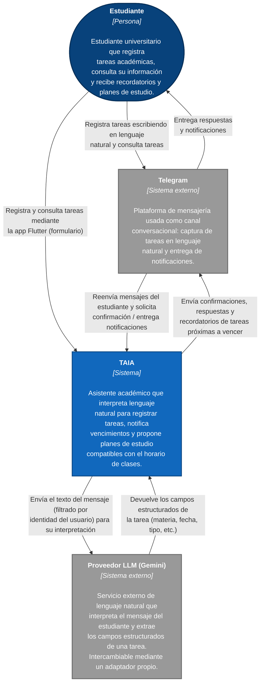

# Diagrama de Contexto - TAIA
### Task Artificial Intelligence Assistant

**Convenciones**

| Color | Significado |
| ----- | ----------- |
| Azul oscuro | Persona (actor humano) |
| Azul | Sistema en alcance del proyecto |
| Gris | Sistema externo (no lo construimos ni lo controlamos) |
