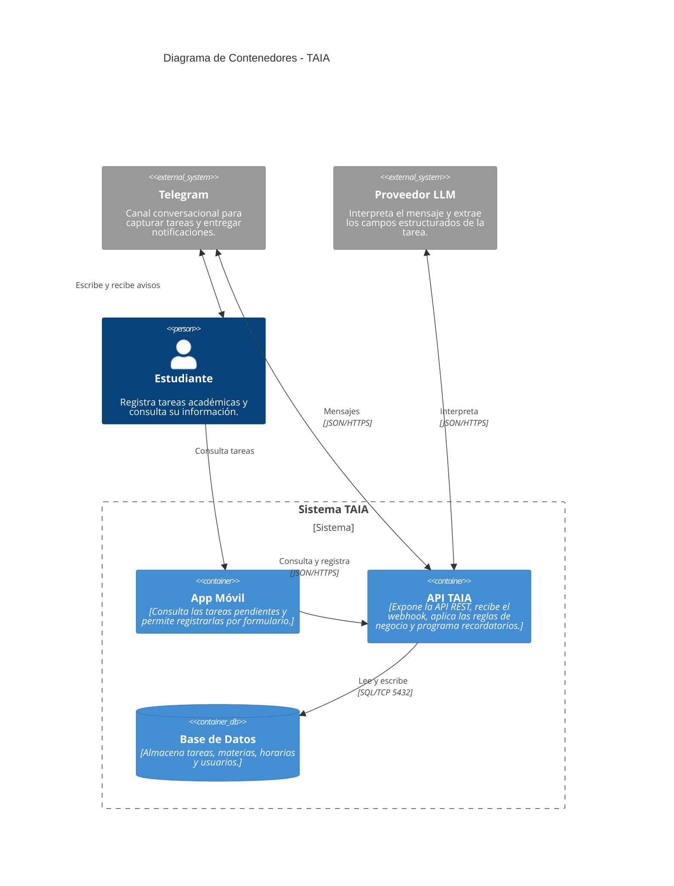

# Diagrama de Contenedores - TAIA
### Task Artificial Intelligence Assistant

**Convenciones**

| Color | Significado |
| ----- | ----------- |
| Azul oscuro | Persona (actor humano) |
| Azul claro | Contenedor (unidad ejecutable o de almacenamiento) |
| Gris | Sistema externo (no lo construimos ni lo controlamos) |
