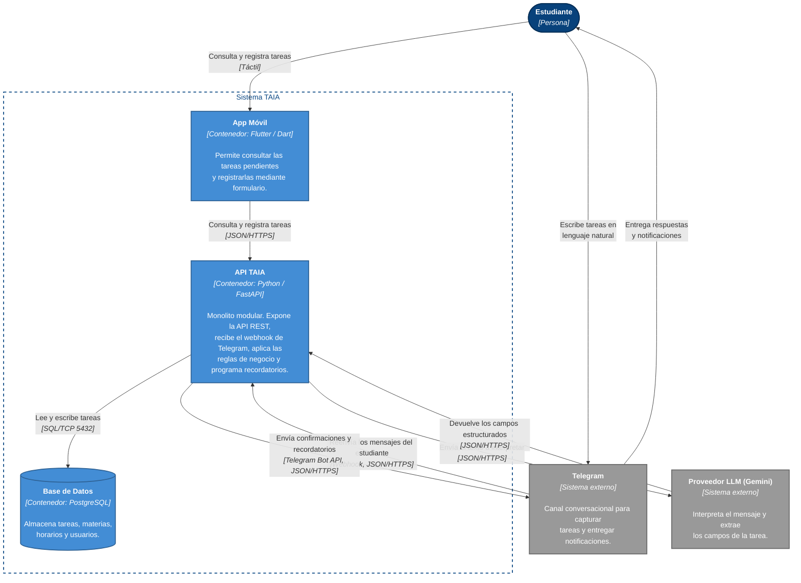

# Diagrama de Contenedores - TAIA
### Task Artificial Intelligence Assistant

Este diagrama corresponde al **nivel 2 del modelo C4**. Hace zoom dentro del sistema TAIA
presentado en el [diagrama de contexto](C4-ContextoTAIA.md) y muestra las unidades
ejecutables y de almacenamiento que lo componen, junto con la tecnología de cada una.

## Contenedores

| Contenedor | Tecnología | Responsabilidad |
| ---------- | ---------- | --------------- |
| App Móvil | Flutter / Dart | Consulta de tareas pendientes y registro por formulario. |
| API TAIA | Python / FastAPI | Monolito modular: API REST, webhook de Telegram, reglas de negocio, adaptador de IA y programación de recordatorios. |
| Base de Datos | PostgreSQL | Persistencia de tareas, materias, horarios y usuarios. |

## Convenciones

| Color | Significado |
| ----- | ----------- |
| Azul oscuro | Persona (actor humano) |
| Azul claro | Contenedor (unidad ejecutable o de almacenamiento) |
| Gris | Sistema externo (no lo construimos ni lo controlamos) |
| Borde punteado | Límite del sistema TAIA |

Cada relación indica la tecnología de comunicación entre corchetes. A diferencia del
diagrama de contexto, en el nivel de contenedores la tecnología es parte obligatoria
de la notación.

## Alcance del nivel

Los módulos `academic`, `ai` y `reminders` del backend **no aparecen como contenedores**.
Se ejecutan dentro del mismo proceso de la API TAIA, por lo que en C4 son *componentes*
y corresponden al nivel 3. Esto es coherente con la decisión de
[ADR-0001](../adr/0001.md), que adopta un monolito modular con un único despliegue.

## Decisiones asumidas en este diagrama

Dos decisiones de diseño determinan cuántos contenedores existen. Ambas se resolvieron
en favor de mantener un único despliegue:

**Recepción de mensajes de Telegram: webhook.** Telegram invoca un endpoint expuesto por
la API TAIA. La alternativa, *long polling*, requeriría un proceso dedicado ejecutando un
bucle de consulta permanente, lo que añadiría un cuarto contenedor.

**Programación de recordatorios: en proceso.** El planificador se ejecuta dentro de la API
TAIA. Es suficiente para el MVP, pero tiene un límite conocido: si en el futuro se
despliega más de una réplica de la API, cada réplica dispararía el mismo recordatorio y el
estudiante recibiría notificaciones duplicadas. En ese escenario, el planificador debe
extraerse a un contenedor propio.
