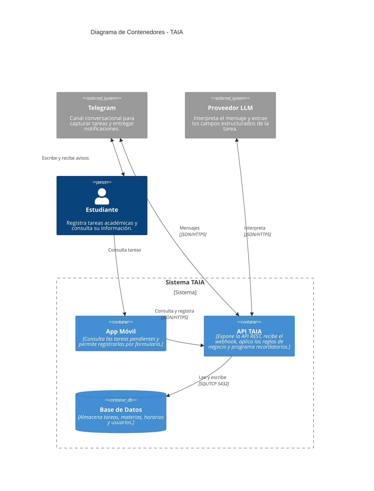
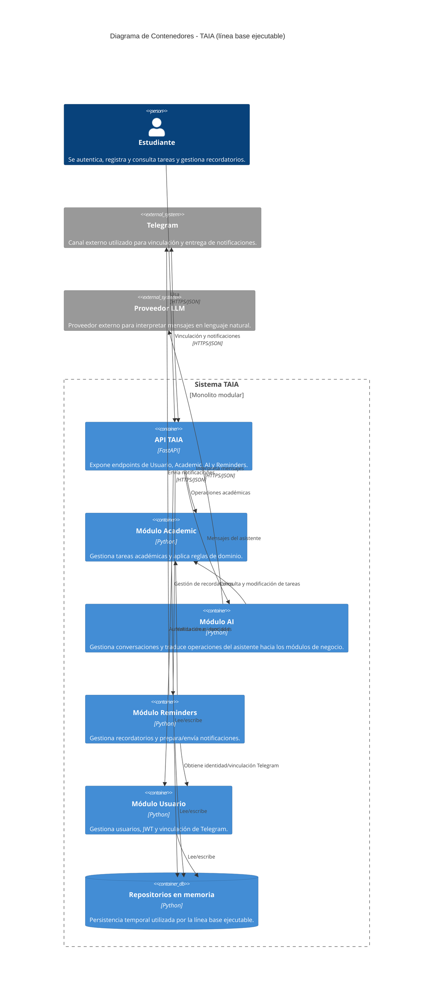

# Diagrama de Contenedores - TAIA
### Task Artificial Intelligence Assistant

**Convenciones**

| Color | Significado |
| ----- | ----------- |
| Azul oscuro | Persona (actor humano) |
| Azul claro | Contenedor (unidad ejecutable o de almacenamiento) |
| Gris | Sistema externo (no lo construimos ni lo controlamos) |

# Diagrama de Contenedores - TAIA
### Task Artificial Intelligence Assistant

El siguiente diagrama representa la **línea base backend actualmente ejecutable**. La aplicación móvil y PostgreSQL permanecen como componentes de la arquitectura objetivo y no se presentan como implementaciones disponibles en esta versión.

**Componentes objetivo aún no implementados en esta línea base:** cliente Flutter y PostgreSQL.
