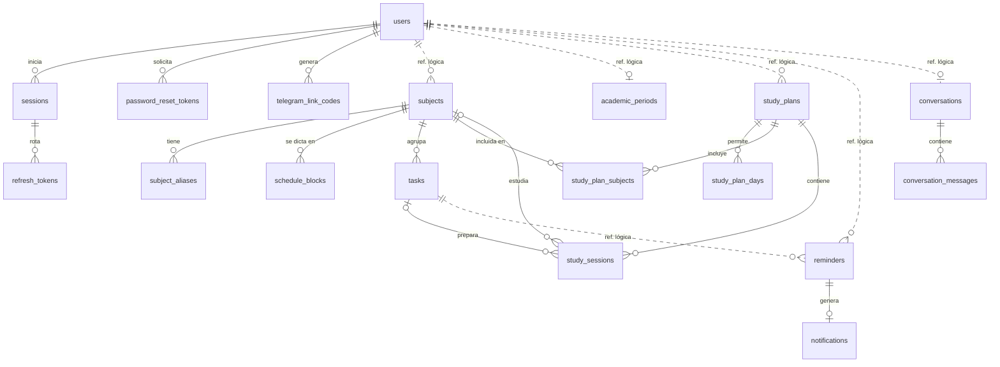

# Diccionario de datos de TAIA

Modelo de datos lógico y físico de TAIA para PostgreSQL, derivado de [`requerimientos.md`](requerimientos.md). A partir de este documento se construyen:
- Los modelos ORM de SQLAlchemy, en los adaptadores de salida de cada módulo.
- Las migraciones de Alembic.
- Los esquemas de la API.

---

## Contenido

1. [Convenciones](#1-convenciones)
2. [Tipos enumerados](#2-tipos-enumerados)
3. [Resumen de tablas](#3-resumen-de-tablas)
4. [Diagrama entidad-relación](#4-diagrama-entidad-relación)
5. [Módulo Usuario](#5-módulo-usuario)
6. [Módulo Academic](#6-módulo-academic)
7. [Módulo Reminders](#7-módulo-reminders)
8. [Módulo AI](#8-módulo-ai)
9. [Datos derivados (no se almacenan)](#9-datos-derivados-no-se-almacenan)
10. [Verificación de normalización](#10-verificación-de-normalización)

---

## 1. Convenciones

### Nombres

- Tablas, columnas, tipos e índices en inglés y en `snake_case`. Las tablas van en plural.
- **La API usa los mismos nombres en el JSON** (`due_at`, `completed_at`, `full_name`…). Un campo que la API expone y que existe en la base de datos se llama igual en ambos lados. Los campos derivados (sección 9) tienen nombre propio en la API y no existen como columna.
- Columnas de auditoría: `created_at` y `updated_at`. El borrado lógico usa `deleted_at`, el archivado usa `archived_at` y la desactivación usa `deactivated_at`.

### Claves

- Clave primaria `id` de tipo `uuid`, generada por la aplicación (`uuid4`) en el dominio.
- Excepción: las tablas de registro con mucho volumen y sin identidad de negocio usan `bigint GENERATED ALWAYS AS IDENTITY`.
- Claves foráneas con el formato `<entidad_en_singular>_id`.

### Referencias entre módulos

Cada tabla tiene un único módulo propietario (ver `propiedad_datos_s6.md`).
- **Dentro de un módulo**, las relaciones usan `FOREIGN KEY`.
- **Entre módulos**, las referencias son **lógicas**: una columna `uuid` sin `FOREIGN KEY`, cuya existencia y pertenencia valida el módulo propietario mediante su puerto de entrada.

Esto no deja registros huérfanos, porque usuarios, tareas y asignaturas con actividades nunca se eliminan físicamente (RT-04). En este documento, una referencia lógica se marca como **Ref. lógica**.

### Tipos

| Dato | Tipo PostgreSQL |
|---|---|
| Identificador | `uuid` |
| Instante (fecha y hora) | `timestamptz`. Se guarda en UTC y se presenta en America/Bogota (RT-03). |
| Hora recurrente del horario | `time` (sin zona). Representa la hora de reloj en Colombia, como "lunes 08:00". |
| Fecha sin hora | `date` |
| Texto con límite de negocio | `varchar(n)` con el límite del requerimiento |
| Hash de token (SHA-256 en hexadecimal) | `char(64)` |
| Conjunto cerrado de valores | `ENUM` nativo de PostgreSQL (sección 2) |

### Eliminación

| Tipo de dato | Cómo se elimina |
|---|---|
| Datos del usuario con dependientes | Borrado lógico (RT-04). |
| Datos técnicos sin dependientes (tokens vencidos, intentos fallidos, mensajes antiguos del agente) | Borrado físico, según la retención de cada tabla. |

---

## 2. Tipos enumerados

| Tipo | Valores | Uso |
|---|---|---|
| `task_type` | `task`, `exam` | `tasks.type` |
| `weekday` | `monday`, `tuesday`, `wednesday`, `thursday`, `friday`, `saturday`, `sunday` | `schedule_blocks.weekday`, `study_plan_days.weekday` |
| `reminder_origin` | `automatic`, `custom` | `reminders.origin` |
| `reminder_status` | `pending`, `sent`, `cancelled` | `reminders.status` |
| `study_plan_status` | `proposed`, `accepted`, `discarded` | `study_plans.status` |
| `study_preference` | `between_classes`, `after_classes`, `both` | `study_plans.preference` |
| `message_role` | `user`, `assistant` | `conversation_messages.role` |

PostgreSQL ordena los `ENUM` por el orden de declaración. Por eso `weekday` se declara de lunes a domingo: así los horarios se ordenan bien sin columnas extra.

**Alembic no detecta** cuando se agrega un valor a un `ENUM` que ya existe. Ese cambio se escribe a mano en la migración (`ALTER TYPE ... ADD VALUE`).

---

## 3. Resumen de tablas

| Módulo | Tabla | Descripción | Requerimientos | Prioridad |
|---|---|---|---|---|
| Usuario | `users` | Cuenta del estudiante | RF-USR-01, 05, 06, 09, RF-TEL-01, 03 | MVP |
| Usuario | `sessions` | Sesión iniciada en un dispositivo | RF-USR-03, 04, RF-NOT-01 | MVP |
| Usuario | `refresh_tokens` | Tokens de renovación de una sesión | RF-USR-03 | MVP |
| Usuario | `password_reset_tokens` | Tokens de recuperación de contraseña | RF-USR-08 | MVP |
| Usuario | `telegram_link_codes` | Códigos temporales de vinculación con Telegram | RF-TEL-01 | MVP |
| Usuario | `failed_login_attempts` | Intentos fallidos de inicio de sesión | RNF-03 | MVP |
| Academic | `subjects` | Asignaturas | RF-ASG-01…05 | MVP |
| Academic | `subject_aliases` | Alias de asignaturas | RF-ASG-09 | Deseable |
| Academic | `academic_periods` | Período académico del usuario | RF-ASG-08 | Deseable |
| Academic | `schedule_blocks` | Bloques del horario de clases | RF-ASG-06, 07 | MVP |
| Academic | `tasks` | Tareas y exámenes | RF-TAR-01…11 | MVP |
| Academic | `study_plans` | Planes de estudio y preferencias del formulario | RF-EST-01…03 | MVP |
| Academic | `study_plan_days` | Días disponibles de un plan | RF-EST-01 | MVP |
| Academic | `study_plan_subjects` | Asignaturas incluidas en un plan | RF-EST-01 | MVP |
| Academic | `study_sessions` | Sesiones de estudio generadas | RF-EST-02, 03 | MVP |
| Reminders | `reminders` | Recordatorios programados | RF-REC-01…07 | MVP |
| Reminders | `notifications` | Notificaciones generadas por recordatorios | RF-NOT-02…04 | MVP |
| AI | `conversations` | Estado de la conversación con el agente | RF-AGT-04, 15 | MVP |
| AI | `conversation_messages` | Mensajes recientes de la conversación | RF-AGT-15, 19 | MVP |

El plan de estudio pertenece a Academic porque sus reglas se validan contra el horario y las tareas (RF-EST-02). El módulo AI solo genera la propuesta y la entrega a Academic mediante su puerto.

---

## 4. Diagrama entidad-relación

Las líneas continuas son `FOREIGN KEY` dentro de un módulo. Las punteadas son referencias lógicas entre módulos.

---

## 5. Módulo Usuario

### 5.1 `users`

Cuenta de un estudiante. Nunca se elimina físicamente (RF-USR-09).

| Columna | Tipo | Nulo | Por defecto | Descripción |
|---|---|---|---|---|
| `id` | `uuid` | No | | Clave primaria. |
| `full_name` | `varchar(100)` | No | | Nombres y apellidos en un solo campo. |
| `email` | `varchar(254)` | No | | Correo en minúsculas. Identificador de inicio de sesión y de recuperación. |
| `password_hash` | `varchar(255)` | No | | Hash con sal (RNF-01). Formato `pbkdf2_sha256$iteraciones$sal$hash`. |
| `telegram_user_id` | `bigint` | Sí | | Identificador de la cuenta de Telegram vinculada. |
| `telegram_linked_at` | `timestamptz` | Sí | | Momento de la vinculación con Telegram. |
| `deactivated_at` | `timestamptz` | Sí | | Momento de la desactivación. `NULL` = cuenta activa. |
| `created_at` | `timestamptz` | No | `now()` | Fecha de registro. |
| `updated_at` | `timestamptz` | No | `now()` | Última modificación. |

**Restricciones**
- `PRIMARY KEY (id)`
- `UNIQUE (email)`: también frente a cuentas desactivadas.
- `UNIQUE (telegram_user_id)`: una cuenta de Telegram por usuario.
- `CHECK (email = lower(email))`
- `CHECK (char_length(trim(full_name)) > 0)`
- `CHECK (telegram_user_id > 0)`
- `CHECK ((telegram_user_id IS NULL) = (telegram_linked_at IS NULL))`

**Reglas**
- Al desactivar la cuenta se desvincula Telegram: `telegram_user_id` y `telegram_linked_at` pasan a `NULL`.
- La reactivación (D-11) pone `deactivated_at` en `NULL`.

### 5.2 `sessions`

Sesión iniciada en un dispositivo. El token de acceso JWT lleva el `id` de la sesión en la claim `sid`. En cada petición se verifica que la sesión no esté revocada (RF-USR-04).

| Columna | Tipo | Nulo | Por defecto | Descripción |
|---|---|---|---|---|
| `id` | `uuid` | No | | Clave primaria. Se incluye en el JWT como `sid`. |
| `user_id` | `uuid` | No | | FK a `users.id`. |
| `fcm_token` | `text` | Sí | | Token de Firebase Cloud Messaging del dispositivo (RF-NOT-01). |
| `created_at` | `timestamptz` | No | `now()` | Inicio de la sesión. |
| `revoked_at` | `timestamptz` | Sí | | Momento del cierre o revocación. `NULL` = sesión activa. |

**Restricciones**
- `PRIMARY KEY (id)`
- `FOREIGN KEY (user_id) REFERENCES users (id)`
- `UNIQUE (fcm_token)`: un dispositivo pertenece a una sola sesión.
- Índice `(user_id) WHERE revoked_at IS NULL`

**Reglas**
- Cerrar la sesión pone `revoked_at` y deja `fcm_token` en `NULL`.
- Reminders obtiene los tokens FCM de un usuario mediante el puerto de Usuario, nunca leyendo esta tabla.
- Si FCM reporta un token inválido, Reminders se lo informa a Usuario, que lo pone en `NULL`.

### 5.3 `refresh_tokens`

Tokens de renovación de una sesión, con rotación de un solo uso (RF-USR-03).

| Columna | Tipo | Nulo | Por defecto | Descripción |
|---|---|---|---|---|
| `id` | `uuid` | No | | Clave primaria. |
| `session_id` | `uuid` | No | | FK a `sessions.id`. |
| `token_hash` | `char(64)` | No | | SHA-256 del token. El token en claro nunca se guarda. |
| `created_at` | `timestamptz` | No | `now()` | Emisión. |
| `expires_at` | `timestamptz` | No | | Expiración (30 días después de la emisión). |
| `used_at` | `timestamptz` | Sí | | Momento en que se usó para rotar. |

**Restricciones**
- `PRIMARY KEY (id)`
- `FOREIGN KEY (session_id) REFERENCES sessions (id) ON DELETE CASCADE`
- `UNIQUE (token_hash)`
- `CHECK (expires_at > created_at)`

**Reglas**
- Si se presenta un token con `used_at` distinto de `NULL`, se trata como un robo: se revocan todas las sesiones del usuario.
- Retención: las filas de sesiones revocadas o expiradas hace más de 30 días se eliminan físicamente.

### 5.4 `password_reset_tokens`

Tokens de recuperación de contraseña (RF-USR-08).

| Columna | Tipo | Nulo | Por defecto | Descripción |
|---|---|---|---|---|
| `id` | `uuid` | No | | Clave primaria. |
| `user_id` | `uuid` | No | | FK a `users.id`. |
| `token_hash` | `char(64)` | No | | SHA-256 del token. |
| `created_at` | `timestamptz` | No | `now()` | Emisión. Se usa para limitar las solicitudes por hora (RNF-03). |
| `expires_at` | `timestamptz` | No | | Expiración (15 minutos después de la emisión). |
| `used_at` | `timestamptz` | Sí | | Momento en que se usó. |

**Restricciones**
- `PRIMARY KEY (id)`
- `FOREIGN KEY (user_id) REFERENCES users (id)`
- `UNIQUE (token_hash)`
- `CHECK (expires_at > created_at)`
- Índice `(user_id, created_at)`

**Reglas**
- Al emitir un token nuevo, los anteriores no usados del mismo usuario se invalidan: su `expires_at` pasa a la hora actual.
- Retención: 24 horas.

### 5.5 `telegram_link_codes`

Códigos de un solo uso para vincular Telegram (RF-TEL-01).

| Columna | Tipo | Nulo | Por defecto | Descripción |
|---|---|---|---|---|
| `id` | `uuid` | No | | Clave primaria. |
| `user_id` | `uuid` | No | | FK a `users.id`. |
| `code_hash` | `char(64)` | No | | SHA-256 del código incluido en el enlace directo. |
| `created_at` | `timestamptz` | No | `now()` | Emisión. |
| `expires_at` | `timestamptz` | No | | Expiración (10 minutos después de la emisión). |
| `used_at` | `timestamptz` | Sí | | Momento de la confirmación. |

**Restricciones**
- `PRIMARY KEY (id)`
- `FOREIGN KEY (user_id) REFERENCES users (id)`
- `UNIQUE (code_hash)`
- `CHECK (expires_at > created_at)`

**Retención:** 24 horas.

### 5.6 `failed_login_attempts`

Intentos fallidos de inicio de sesión, para el límite de intentos (RNF-03).

| Columna | Tipo | Nulo | Por defecto | Descripción |
|---|---|---|---|---|
| `id` | `bigint` | No | identity | Clave primaria. |
| `email` | `varchar(254)` | No | | Correo normalizado que se intentó usar. No es FK, porque el correo puede no existir. |
| `attempted_at` | `timestamptz` | No | `now()` | Momento del intento. |

**Restricciones**
- `PRIMARY KEY (id)`
- Índice `(email, attempted_at)`

**Retención:** 24 horas.

---

## 6. Módulo Academic

### 6.1 `subjects`

Asignaturas del estudiante (RF-ASG-01…05).

| Columna | Tipo | Nulo | Por defecto | Descripción |
|---|---|---|---|---|
| `id` | `uuid` | No | | Clave primaria. |
| `user_id` | `uuid` | No | | **Ref. lógica** a `users.id`. Propietario. |
| `name` | `varchar(100)` | No | | Nombre tal como lo escribió el usuario. |
| `normalized_name` | `varchar(100)` | No | | Nombre en minúsculas, sin tildes y con espacios simples. Lo calcula el dominio. |
| `teacher` | `varchar(100)` | Sí | | Docente. |
| `archived_at` | `timestamptz` | Sí | | Momento del archivado. `NULL` = activa. |
| `created_at` | `timestamptz` | No | `now()` | |
| `updated_at` | `timestamptz` | No | `now()` | |

**Restricciones**
- `PRIMARY KEY (id)`
- `UNIQUE (user_id, normalized_name)`
- `CHECK (char_length(trim(name)) > 0)`

**Reglas**
- La asignatura solo se elimina físicamente si no tiene ninguna fila en `tasks`, incluidas las tareas con `deleted_at`. En cualquier otro caso se archiva (RF-ASG-04).
- La restricción se garantiza con `ON DELETE RESTRICT` en `tasks.subject_id`.

### 6.2 `subject_aliases` (Deseable)

Alias cortos para reconocer la asignatura en lenguaje natural (RF-ASG-09, RF-AGT-10).

| Columna | Tipo | Nulo | Por defecto | Descripción |
|---|---|---|---|---|
| `id` | `uuid` | No | | Clave primaria. |
| `subject_id` | `uuid` | No | | FK a `subjects.id`. |
| `alias` | `varchar(50)` | No | | Alias como lo escribió el usuario. |
| `normalized_alias` | `varchar(50)` | No | | Alias normalizado con las mismas reglas que `normalized_name`. |
| `created_at` | `timestamptz` | No | `now()` | |

**Restricciones**
- `PRIMARY KEY (id)`
- `FOREIGN KEY (subject_id) REFERENCES subjects (id) ON DELETE CASCADE`
- `UNIQUE (subject_id, normalized_alias)`

### 6.3 `academic_periods` (Deseable)

Período académico vigente del usuario (RF-ASG-08). Cada usuario tiene uno como máximo.

| Columna | Tipo | Nulo | Por defecto | Descripción |
|---|---|---|---|---|
| `user_id` | `uuid` | No | | Clave primaria. **Ref. lógica** a `users.id`. |
| `start_date` | `date` | No | | Primer día del período. |
| `end_date` | `date` | No | | Último día del período. |
| `updated_at` | `timestamptz` | No | `now()` | |

**Restricciones**
- `PRIMARY KEY (user_id)`
- `CHECK (end_date > start_date)`

### 6.4 `schedule_blocks`

Bloques semanales del horario de clases (RF-ASG-06, 07).

| Columna | Tipo | Nulo | Por defecto | Descripción |
|---|---|---|---|---|
| `id` | `uuid` | No | | Clave primaria. |
| `subject_id` | `uuid` | No | | FK a `subjects.id`. |
| `weekday` | `weekday` | No | | Día de la semana. |
| `start_time` | `time` | No | | Hora de inicio (hora de Colombia). |
| `end_time` | `time` | No | | Hora de fin (hora de Colombia). |
| `room` | `varchar(50)` | Sí | | Aula. |
| `created_at` | `timestamptz` | No | `now()` | |
| `updated_at` | `timestamptz` | No | `now()` | |

**Restricciones**
- `PRIMARY KEY (id)`
- `FOREIGN KEY (subject_id) REFERENCES subjects (id) ON DELETE CASCADE`
- `CHECK (end_time > start_time)`
- Índice `(subject_id)`

**Reglas**
- La regla de no solapamiento entre los bloques de un mismo usuario la valida el caso de uso dentro de la transacción. El usuario se obtiene a través de la asignatura, así que no se puede expresar como una restricción de la tabla.

### 6.5 `tasks`

Tareas y exámenes (RF-TAR-01…11).

| Columna | Tipo | Nulo | Por defecto | Descripción |
|---|---|---|---|---|
| `id` | `uuid` | No | | Clave primaria. |
| `subject_id` | `uuid` | No | | FK a `subjects.id`. El usuario propietario se obtiene a través de la asignatura. |
| `type` | `task_type` | No | `'task'` | Tarea o examen. |
| `title` | `varchar(200)` | No | | Título ingresado o generado por el agente (RF-AGT-06). |
| `description` | `varchar(2000)` | Sí | | Descripción. |
| `due_at` | `timestamptz` | No | | Fecha límite o, en un examen, fecha de presentación. |
| `completed_at` | `timestamptz` | Sí | | Momento de completado. `NULL` = no completada. |
| `deleted_at` | `timestamptz` | Sí | | Borrado lógico (RF-TAR-10). |
| `created_at` | `timestamptz` | No | `now()` | |
| `updated_at` | `timestamptz` | No | `now()` | |

**Restricciones**
- `PRIMARY KEY (id)`
- `FOREIGN KEY (subject_id) REFERENCES subjects (id) ON DELETE RESTRICT`
- `CHECK (char_length(trim(title)) > 0)`
- Índice `(subject_id, due_at) WHERE deleted_at IS NULL`: permite listar por asignatura y ordenar por fecha límite (RF-TAR-04).

**Reglas**
- La regla "la fecha límite debe ser futura" se valida solo al crear la tarea, en el dominio. No es un `CHECK` porque deja de cumplirse con el paso del tiempo.
- Las consultas por usuario se hacen con `JOIN subjects ON subjects.id = tasks.subject_id WHERE subjects.user_id = :user_id`.

### 6.6 `study_plans`

Plan de estudio con las preferencias del formulario (RF-EST-01…03). El plan cubre 7 días desde `start_date` (D-13).

| Columna | Tipo | Nulo | Por defecto | Descripción |
|---|---|---|---|---|
| `id` | `uuid` | No | | Clave primaria. |
| `user_id` | `uuid` | No | | **Ref. lógica** a `users.id`. |
| `status` | `study_plan_status` | No | `'proposed'` | Estado del plan. |
| `preference` | `study_preference` | No | | Entre huecos de clases, después de clases o ambas. |
| `window_start` | `time` | No | `'06:00'` | Inicio de la franja permitida (hora de Colombia). |
| `window_end` | `time` | No | `'22:00'` | Fin de la franja permitida (hora de Colombia). |
| `session_minutes` | `smallint` | No | `60` | Duración de cada sesión. |
| `start_date` | `date` | No | | Primer día del plan. |
| `created_at` | `timestamptz` | No | `now()` | |
| `updated_at` | `timestamptz` | No | `now()` | |

**Restricciones**
- `PRIMARY KEY (id)`
- `CHECK (window_start >= '05:00' AND window_end <= '23:00' AND window_end > window_start)`
- `CHECK (session_minutes > 0)`
- Índice único `(user_id) WHERE status = 'accepted'`: un solo plan aceptado por usuario.

**Reglas**
- Al aceptar un plan, el plan aceptado anterior pasa a `discarded`, en la misma transacción.

### 6.7 `study_plan_days`

Días disponibles de un plan. Si en el formulario no se selecciona ninguno, se guardan los 7 días (RF-EST-01).

| Columna | Tipo | Nulo | Por defecto | Descripción |
|---|---|---|---|---|
| `study_plan_id` | `uuid` | No | | FK a `study_plans.id`. |
| `weekday` | `weekday` | No | | Día disponible. |

**Restricciones**
- `PRIMARY KEY (study_plan_id, weekday)`
- `FOREIGN KEY (study_plan_id) REFERENCES study_plans (id) ON DELETE CASCADE`

### 6.8 `study_plan_subjects`

Asignaturas incluidas en un plan. Si en el formulario no se selecciona ninguna, se guardan todas las activas (RF-EST-01).

| Columna | Tipo | Nulo | Por defecto | Descripción |
|---|---|---|---|---|
| `study_plan_id` | `uuid` | No | | FK a `study_plans.id`. |
| `subject_id` | `uuid` | No | | FK a `subjects.id`. |

**Restricciones**
- `PRIMARY KEY (study_plan_id, subject_id)`
- `FOREIGN KEY (study_plan_id) REFERENCES study_plans (id) ON DELETE CASCADE`
- `FOREIGN KEY (subject_id) REFERENCES subjects (id) ON DELETE CASCADE`

### 6.9 `study_sessions`

Sesiones de estudio de un plan (RF-EST-02). Una sesión prepara una tarea concreta o estudia una asignatura en general.

| Columna | Tipo | Nulo | Por defecto | Descripción |
|---|---|---|---|---|
| `id` | `uuid` | No | | Clave primaria. |
| `study_plan_id` | `uuid` | No | | FK a `study_plans.id`. |
| `task_id` | `uuid` | Sí | | FK a `tasks.id`. Tarea que prepara la sesión. |
| `subject_id` | `uuid` | Sí | | FK a `subjects.id`. Asignatura, cuando la sesión no es para una tarea concreta. |
| `starts_at` | `timestamptz` | No | | Inicio. |
| `ends_at` | `timestamptz` | No | | Fin. |

**Restricciones**
- `PRIMARY KEY (id)`
- `FOREIGN KEY (study_plan_id) REFERENCES study_plans (id) ON DELETE CASCADE`
- `FOREIGN KEY (task_id) REFERENCES tasks (id)`
- `FOREIGN KEY (subject_id) REFERENCES subjects (id) ON DELETE CASCADE`
- `CHECK ((task_id IS NULL) <> (subject_id IS NULL))`: exactamente una de las dos.
- `CHECK (ends_at > starts_at)`
- Índice `(study_plan_id, starts_at)`

**Reglas**
- Las reglas de RF-EST-02 las valida el caso de uso de Academic antes de guardar: sin solapamiento con clases ni con otras sesiones, dentro de la franja y de los días permitidos, y antes de la fecha límite.

---

## 7. Módulo Reminders

### 7.1 `reminders`

Recordatorios programados de una tarea (RF-REC-01…07).

| Columna | Tipo | Nulo | Por defecto | Descripción |
|---|---|---|---|---|
| `id` | `uuid` | No | | Clave primaria. |
| `user_id` | `uuid` | No | | **Ref. lógica** a `users.id`. Propietario. |
| `task_id` | `uuid` | No | | **Ref. lógica** a `tasks.id`. |
| `scheduled_at` | `timestamptz` | No | | Momento en que debe notificarse. |
| `custom_message` | `varchar(500)` | Sí | | Mensaje escrito por el usuario. `NULL` = se usa el mensaje por defecto (sección 9). |
| `origin` | `reminder_origin` | No | | Automático (RF-REC-02) o personalizado. |
| `status` | `reminder_status` | No | `'pending'` | Estado del recordatorio. |
| `created_at` | `timestamptz` | No | `now()` | |
| `updated_at` | `timestamptz` | No | `now()` | |

**Restricciones**
- `PRIMARY KEY (id)`
- Índice `(scheduled_at) WHERE status = 'pending'`: lo usa el proceso de envío (RF-NOT-02).
- Índice `(task_id)`: para cancelar o recalcular los recordatorios de una tarea (RF-REC-06).
- Índice `(user_id)`

**Reglas**
- El proceso de envío toma los recordatorios con `UPDATE ... SET status = 'sent' WHERE id = :id AND status = 'pending'`. Si la actualización no afecta ninguna fila, otro proceso ya lo tomó, lo que garantiza la idempotencia (RF-NOT-02).
- Solo se eliminan físicamente los recordatorios sin notificación (`pending` o `cancelled`). Un recordatorio `sent` no se puede eliminar, para conservar la bandeja (RF-REC-05).

### 7.2 `notifications`

Notificación generada por un recordatorio, que se muestra en la bandeja (RF-NOT-02…04). Cada recordatorio genera como máximo una.

| Columna | Tipo | Nulo | Por defecto | Descripción |
|---|---|---|---|---|
| `id` | `uuid` | No | | Clave primaria. |
| `reminder_id` | `uuid` | No | | FK a `reminders.id`. El usuario se obtiene a través del recordatorio. |
| `message` | `varchar(500)` | No | | Texto enviado. Es una copia histórica: no cambia si después se edita la tarea. |
| `created_at` | `timestamptz` | No | `now()` | Momento en que se generó. |
| `push_attempts` | `smallint` | No | `0` | Intentos de envío push realizados. |
| `push_sent_at` | `timestamptz` | Sí | | Momento del envío push exitoso. |
| `read_at` | `timestamptz` | Sí | | Momento en que el usuario la leyó. `NULL` = no leída. |

**Restricciones**
- `PRIMARY KEY (id)`
- `FOREIGN KEY (reminder_id) REFERENCES reminders (id) ON DELETE RESTRICT`
- `UNIQUE (reminder_id)`: una notificación por recordatorio.
- `CHECK (push_attempts BETWEEN 0 AND 4)`: un intento inicial y hasta 3 reintentos.

**Reglas**
- Si el usuario no tiene dispositivos (RF-NOT-04), la notificación queda con `push_attempts = 0` y `push_sent_at = NULL`, y no se reintenta.
- Se reintentan las notificaciones con `push_sent_at IS NULL` y `push_attempts` entre 1 y 3.

---

## 8. Módulo AI

### 8.1 `conversations`

Estado de la conversación con el agente. Hay una por usuario y se comparte entre los canales app y Telegram (RF-AGT-15).

| Columna | Tipo | Nulo | Por defecto | Descripción |
|---|---|---|---|---|
| `user_id` | `uuid` | No | | Clave primaria. **Ref. lógica** a `users.id`. |
| `pending_action` | `jsonb` | Sí | | Acción de escritura que espera confirmación (RF-AGT-04): tipo, datos de la tarea e identificador de la tarea objetivo. |
| `pending_action_expires_at` | `timestamptz` | Sí | | Expiración de la acción pendiente (10 minutos). |
| `updated_at` | `timestamptz` | No | `now()` | |

**Restricciones**
- `PRIMARY KEY (user_id)`
- `CHECK ((pending_action IS NULL) = (pending_action_expires_at IS NULL))`

**Reglas**
- `pending_action` es un objeto de valor serializado del dominio de AI (`PendingAction`). La base de datos nunca lo consulta por dentro: solo lo guarda y lo devuelve completo.

### 8.2 `conversation_messages`

Mensajes recientes de la conversación. Sirven para dos cosas:
- El contexto del agente: los últimos 10 mensajes o 4000 caracteres de los últimos 30 minutos (RF-AGT-15).
- El límite de uso: los mensajes con rol `user` de la última hora y de las últimas 24 horas (RF-AGT-19).

| Columna | Tipo | Nulo | Por defecto | Descripción |
|---|---|---|---|---|
| `id` | `bigint` | No | identity | Clave primaria. |
| `user_id` | `uuid` | No | | FK a `conversations.user_id`. |
| `role` | `message_role` | No | | Autor del mensaje. |
| `content` | `varchar(4000)` | No | | Texto del mensaje. |
| `created_at` | `timestamptz` | No | `now()` | |

**Restricciones**
- `PRIMARY KEY (id)`
- `FOREIGN KEY (user_id) REFERENCES conversations (user_id) ON DELETE CASCADE`
- Índice `(user_id, created_at)`

**Retención:** 24 horas. Los mensajes más antiguos se eliminan físicamente (RNF-05).

---

## 9. Datos derivados (no se almacenan)

Se calculan en el dominio o en la consulta y se exponen en la API con estos nombres.

| Campo en la API | Entidad | Regla de cálculo | Requerimiento |
|---|---|---|---|
| `status` (`active`, `inactive`) | Usuario | `inactive` si `deactivated_at` no es `NULL`. Si además pasaron más de 30 días, la cuenta no se puede reactivar. | RF-USR-09, D-11 |
| `telegram_linked` | Usuario | `telegram_user_id IS NOT NULL` | RF-USR-05 |
| `status` (`pending`, `completed`, `overdue`) | Tarea | `completed` si `completed_at` no es `NULL`. Si no, `overdue` si `due_at` ya pasó. Si no, `pending`. | RF-TAR-09 |
| `priority` (`high`, `medium`, `low`) | Tarea pendiente | Según el tiempo que falta para `due_at`: 48 horas o menos, 7 días o menos, o más de 7 días. | RF-TAR-03 |
| `completed_on_time` | Tarea completada | `completed_at <= due_at` | RF-PRF-01 |
| `archived` | Asignatura | `archived_at IS NOT NULL` | RF-ASG-05 |
| `pending_tasks` | Asignatura | Conteo de sus tareas no eliminadas y no completadas | RF-ASG-02 |
| `end_date` | Plan de estudio | `start_date + 6 días` | D-13 |
| Mensaje por defecto | Recordatorio | `"Recuerda: <title> (<subject>) vence el <due_at>"`, armado al enviar con los datos actuales de la tarea | RF-REC-01 |
| `read` | Notificación | `read_at IS NOT NULL` | RF-NOT-03 |
| Conversación vencida | Conversación | El último mensaje tiene más de 30 minutos | RF-AGT-15 |
| Estadísticas y calendario | Varias | Consultas agregadas sobre `tasks`, `subjects` y `schedule_blocks` | RF-PRF-01, RF-TAR-11 |

---

## 10. Verificación de normalización

**Primera forma normal (1FN).**
- Todas las columnas son atómicas. Los valores múltiples (días disponibles y asignaturas de un plan) están en tablas propias.
- Excepción justificada: `conversations.pending_action` (`jsonb`) es un objeto de valor que la base de datos nunca consulta por dentro.

**Segunda forma normal (2FN).**
- Todas las claves primarias son de una sola columna.
- Excepción: `study_plan_days` y `study_plan_subjects`, cuyas claves compuestas no tienen atributos no clave. No hay dependencias parciales.

**Tercera forma normal (3FN).** Se eliminaron estas dependencias transitivas:

| Dato que no se guarda | Por qué | Se obtiene de |
|---|---|---|
| `tasks.user_id` | Depende de `subject_id` | `subjects` |
| `schedule_blocks.user_id` | Depende de `subject_id` | `subjects` |
| `notifications.user_id` | Depende de `reminder_id` | `reminders` |
| Estado del usuario, de la tarea y de la notificación | Son derivados (sección 9) | Las columnas de fecha |
| Fecha de fin del plan | Es derivada | `start_date` |

**Excepciones controladas:**

| Columna | Por qué se guarda |
|---|---|
| `subjects.normalized_name` y `subject_aliases.normalized_alias` | Dependen de `name` y de `alias`. Se guardan porque PostgreSQL necesita una columna para garantizar la unicidad sin distinguir tildes: la función `unaccent` no es inmutable y no se puede usar directamente en un índice. Solo las escribe el dominio. |
| `reminders.user_id` | Se puede deducir de `task_id`, pero `tasks` pertenece a otro módulo y Reminders no puede leer esa tabla. Sin esta columna, Reminders no podría aislar los datos por usuario (RT-02) ni cancelar los recordatorios al desactivar una cuenta (RF-REC-06). |
| `notifications.message` | No es redundante: es el registro histórico de lo que se envió, no el título actual de la tarea. |
