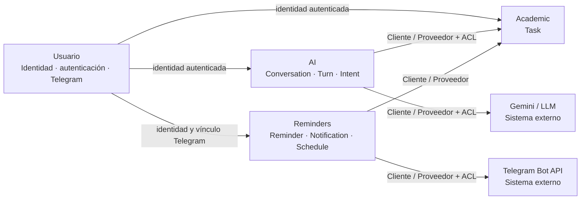

# Mapa de contextos delimitados — S6

## Propósito

Este artefacto detalla el mapa de contextos de TAIA utilizado como evidencia de la Semana 6. Los contextos se identifican por su lenguaje, responsabilidades y propiedad de datos; las carpetas técnicas (`adapters`, `application`, `domain`) son organización interna y no constituyen contextos delimitados.

## Contextos

TAIA se organiza actualmente en cuatro contextos delimitados dentro del monolito modular: **Usuario**, **Academic**, **AI** y **Reminders**. Cada contexto mantiene sus propias responsabilidades, vocabulario y datos. El hecho de que estén desplegados dentro del mismo backend no elimina sus fronteras conceptuales.

| Contexto | Responsabilidad principal | Datos propios relevantes |
|---|---|---|
| **Usuario** | Identidad, autenticación y vínculo con Telegram | `Usuario`, `TelegramLinkToken` |
| **Academic** | Gestión de tareas académicas | `Task` |
| **AI** | Conversación e interpretación de solicitudes | `Conversation`, `Turn`, `Intent`, `PendingAction` |
| **Reminders** | Programación y gestión de recordatorios y notificaciones | `Reminder`, `Notification`, `ReminderSchedule` |

## Mapa

No se identifica actualmente un **núcleo compartido (Shared Kernel)** entre los cuatro contextos. Los datos de un contexto deben permanecer bajo su responsabilidad aunque otros contextos necesiten consultarlos.

## Relaciones entre contextos

Las relaciones se describen utilizando el vocabulario de Domain-Driven Design solicitado para la evidencia S6.

| Relación | Tipo | Situación actual | Regla arquitectónica |
|---|---|---|---|
| **AI → Academic** | Cliente / Proveedor + Capa Anticorrupción | AI define `AcademicGateway` y `AcademicGatewayAdapter` para traducir las operaciones académicas al modelo utilizado por AI. La implementación actual todavía obtiene el repositorio de Academic directamente. | AI debe consumir operaciones académicas mediante el contrato del proveedor y no depender del modelo interno de `Task` ni de su repositorio. |
| **Reminders → Academic** | Cliente / Proveedor | Reminders necesita comprobar que una tarea pertenece al estudiante y asociar el recordatorio a esa tarea. El código actual accede directamente al `TaskRepository` de Academic. | Academic debe exponer una operación de consulta controlada; Reminders debe consumirla mediante `AcademicTaskLookup` sin importar el repositorio interno. |
| **Academic → Usuario** | Cliente / Proveedor | Academic necesita la identidad autenticada para asociar y aislar las tareas por estudiante. | Academic puede recibir `user_id`, pero no debe depender de la implementación HTTP interna de Usuario. |
| **AI → Usuario** | Cliente / Proveedor | AI necesita identificar al estudiante que origina una conversación. | AI debe consumir una abstracción de identidad y no importar el adaptador HTTP de Usuario. |
| **Reminders → Usuario** | Cliente / Proveedor | Reminders necesita identidad y vinculación Telegram para las notificaciones. | Reminders debe consumir contratos de identidad/vinculación sin depender de los adaptadores HTTP internos de Usuario. |
| **AI → Gemini** | Cliente / Proveedor externo + Capa Anticorrupción | `GeminiLLM` encapsula el proveedor externo detrás del puerto `LLM`. | Ningún contexto de dominio debe depender directamente del SDK o modelo específico del proveedor. |
| **Reminders → Telegram** | Cliente / Proveedor externo + Capa Anticorrupción | `TelegramBotApiClient` y `TelegramNotificationSender` aíslan la integración con Telegram. | El dominio de Reminders no debe depender de tipos ni protocolos propios de Telegram. |

La **capa anticorrupción (ACL)** se utiliza cuando una dependencia externa o un contexto proveedor puede introducir un modelo que no debe filtrarse al contexto consumidor. En TAIA esto se refleja especialmente en el `AcademicGatewayAdapter` de AI y en los adaptadores de Telegram. En las relaciones con Academic y Usuario todavía existen puntos de acoplamiento que deben corregirse según la auditoría de esta sección.

## Regla de frontera

Un contexto puede solicitar información a otro mediante un contrato explícito, pero no debe tratar las entidades internas del proveedor como propias ni acceder directamente a sus adaptadores de persistencia.
